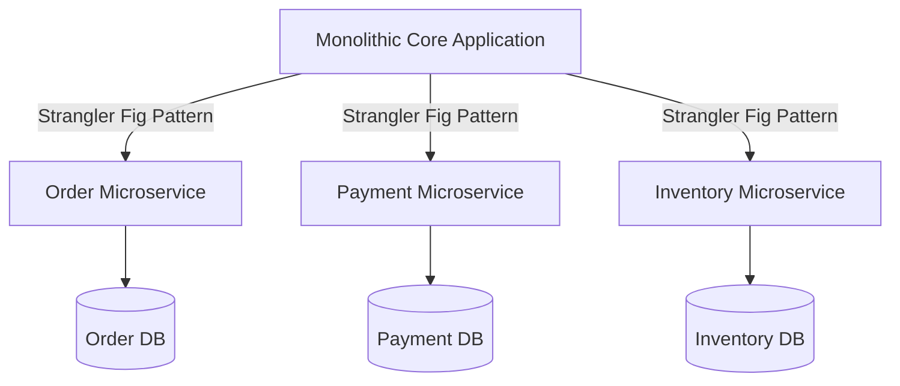

<!-- section:definition -->
## Context and Problem Statement

Our monolithic e-commerce and payment platform experienced deployment bottlenecks as the engineering team expanded from 15 to 90 engineers over 18 months. Changes to any domain required full application redeployments, posing reliability risks.

<!-- section:components -->
## Decision

We decided to decompose the monolithic core into a **Microservices Architecture** using Domain-Driven Design (DDD) Bounded Context boundaries, enforcing a strict Database-per-Service policy.

<!-- section:data-flow -->
## Architecture Decision Diagram (Mermaid Flowchart)

<!-- section:use-cases -->
## Evaluated Options

1. **Modular Monolith:** Easier in the short term, but fails to provide independent CI/CD autonomy and heterogeneous scaling.
2. **Microservices Architecture (Selected):** Introduces operational overhead but enables multi-team organizational scaling.

<!-- section:trade-offs -->
## Consequences and Trade-offs

### Positive Consequences (Pros)
- Decoupled team deployment pipelines.
- Independent horizontal scaling for high-traffic payment domains.

### Negative Consequences and Risks (Cons)
- Requirement for distributed tracing and mTLS security infrastructure.
- Management of eventual consistency across services.

<!-- section:production -->
## Implementation Strategy

- Apply the **Strangler Fig Pattern** to incrementally extract microservices (Payment first, Order second) from the monolith.

<!-- section:security -->
## Security Policy

- Enforce mTLS (Istio Service Mesh) and JWT token propagation across all service-to-service calls.

<!-- section:testing -->
## Testing Strategy

- Integrate Consumer-Driven Contract Testing (Pact) into CI build pipelines.

<!-- section:observability -->
## Observability Decision

- Mandate OpenTelemetry and Jaeger distributed tracing across all service boundaries.

<!-- section:alternatives -->
## Rejected Alternatives

- Maintaining the monolithic codebase (Incompatible with growth targets).

<!-- section:sources -->
## Sources

- ISO/IEC/IEEE 42010:2022 — Architecture Decision Records
- Martin Fowler — *Microservices Guide*
