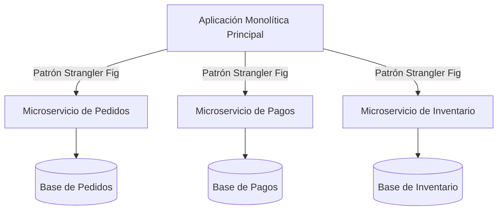

<!-- section:definition -->
## Contexto y Descripción del Problema

Nuestra plataforma monolítica de comercio electrónico experimentó cuellos de botella en los despliegues a medida que el equipo creció de 15 a 90 ingenieros en 18 meses. Los cambios requerían despliegues completos del monolito.

<!-- section:components -->
## Decisión

Decidimos descomponer el núcleo monolítico en una **Arquitectura de Microservicios** utilizando límites de dominio (DDD), aplicando una política estricta de base de datos por servicio.

<!-- section:data-flow -->
## Diagrama de Decisión de Arquitectura (Diagrama Mermaid)

<!-- section:use-cases -->
## Opciones Evaluadas

1. **Monolito Modular:** Más sencillo a corto plazo, pero no satisface la autonomía de despliegue ni el escalado heterogéneo.
2. **Arquitectura de Microservicios (Seleccionada):** Introduce complejidad operativa pero permite el escalado organizacional de múltiples equipos.

<!-- section:trade-offs -->
## Consecuencias y Compromisos

### Consecuencias Positivas (Pros)
- Tuberías de despliegue independientes para cada equipo.
- Escalado horizontal independiente para dominios de alto tráfico.

### Consecuencias Negativas y Riesgos (Contras)
- Requisito de infraestructura para trazabilidad distribuida y mTLS.
- Gestión de la consistencia eventual entre servicios.

<!-- section:production -->
## Estrategia de Implementación

- Aplicar el **Patrón Strangler Fig** para extraer microservicios de forma incremental (Pagos primero, Pedidos después).

<!-- section:security -->
## Política de Seguridad

- Forzar mTLS (Istio Service Mesh) y propagación de tokens JWT en todas las llamadas entre servicios.

<!-- section:testing -->
## Estrategia de Pruebas

- Integrar Pruebas de Contrato (Pact) en las tuberías CI.

<!-- section:observability -->
## Decisión de Observabilidad

- Exigir trazabilidad distribuida con OpenTelemetry y Jaeger en todos los microservicios.

<!-- section:alternatives -->
## Alternativas Rechazadas

- Mantener la base de código monolítica (Incompatible con los objetivos de crecimiento).

<!-- section:sources -->
## Fuentes

- ISO/IEC/IEEE 42010:2022 — Architecture Decision Records
- Martin Fowler — *Microservices Guide*
