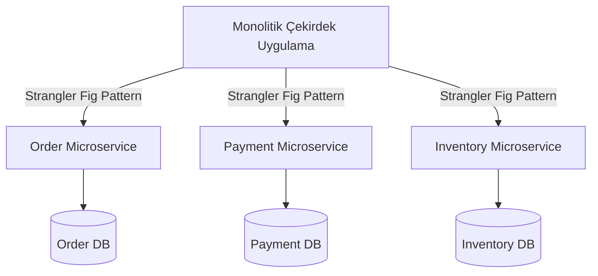

<!-- section:definition -->
## Bağlam ve Problem Tanımı

Mevcut monolitik e-ticaret ve ödeme platformumuz, son 18 ayda mühendislik ekibinin 15 kişiden 90 kişiye büyümesiyle geliştirme tıkanıklıklarına (deployment bottlenecks) neden olmaya başlamıştır. Tek bir kod tabanında yapılan değişiklikler tüm uygulamanın yeniden dağıtılmasını gerektirmekte ve haftalık sürümlerde risk oluşturmaktadır.

<!-- section:components -->
## Karar (Decision)

Domain-Driven Design (DDD) Bounded Context ilkelerine dayanarak; monolitik çekirdeğin kademeli olarak **Mikroservis Mimarisine** bölünmesi ve her servisin kendi veritabanına (Database-per-Service) sahip olması kararlaştırılmıştır.

<!-- section:data-flow -->
## Mimari Karar Diyagramı (Mermaid Akışı)

<!-- section:use-cases -->
## Değerlendirilen Seçenekler

1. **Modüler Monolit:** Kısa vadede kolay ancak heterojen ölçekleme ve bağımsız bağımsız CI/CD süreçlerini tam karşılamıyor.
2. **Mikroservis Mimarisi (Seçilen):** Yüksek operasyonel karmaşıklık getirmekle birlikte organizasyonel büyümeyi destekliyor.

<!-- section:trade-offs -->
## Sonuçlar ve Değiş-Tokuşlar

### Olumlu Sonuçlar (Pros)
- Ekipler arası bağımsız sürüm yayını (decoupled deployment pipelines).
- Kritik servislerin (Ödeme) bağımsız dikey/yatay ölçeklenebilmesi.

### Olumsuz Sonuçlar ve Riskler (Cons)
- Dağıtık izleme ve mTLS güvenlik altyapısı ihtiyacı.
- Nihai tutarlılık (eventual consistency) yönetimi.

<!-- section:production -->
## Uygulama Stratejisi

- **Strangler Fig Pattern:** Monolit sistem tek seferde değil, fonksiyonel modüller bazında (önce Ödeme, sonra Sipariş) sırayla mikroservislere aktarılacaktır.

<!-- section:security -->
## Güvenlik Politikası

- Servisler arası iletişimde mTLS (Istio Service Mesh) ve JWT token aktarımı zorunlu kılınmıştır.

<!-- section:testing -->
## Test Stratejisi

- Tüketici Odaklı Sözleşme Testleri (Pact) CI hatına dahil edilecektir.

<!-- section:observability -->
## Gözlemlenebilirlik Kararı

- OpenTelemetry ve Jaeger ile tüm servisler genelinde Trace ID takibi yapılacaktır.

<!-- section:alternatives -->
## Reddedilen Alternatifler

- Monolitik yapıda devam etmek (Büyüme hedefleriyle uyuşmuyor).

<!-- section:sources -->
## Kaynaklar

- ISO/IEC/IEEE 42010:2022 — Architecture Decision Records
- Martin Fowler — *Microservices Guide*
