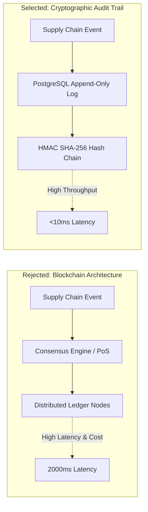

<!-- section:definition -->
## Context and Proposal

To enhance supply chain auditability and data immutability across distributed suppliers, a proposal was submitted to adopt public/private **Blockchain** technologies.

<!-- section:components -->
## Decision (REJECTED)

Following technical evaluation and PoC benchmarks, the **Blockchain proposal was REJECTED**. Instead, we decided to implement a cryptographic Audit Trail built on top of a PostgreSQL append-only hash-chained table.

<!-- section:data-flow -->
## Rationale Diagram (Mermaid Comparison)

<!-- section:use-cases -->
## Evaluated Options

1. **Permissioned Blockchain (Hyperledger Fabric):** Excessive operational overhead, low throughput (TPS), and complex query interfaces.
2. **Cryptographic Append-Only Audit Log (Selected):** High throughput, standard SQL expressiveness, and significantly lower operational cost.

<!-- section:trade-offs -->
## Reasons for Rejection

### Failure Factors
- **High Latency Overhead:** Consensus mechanisms introduced transaction confirmation delays exceeding 2,000ms.
- **Flawed Trust Assumptions:** All participating vendors already trust our centralized identity provider; Byzantine Fault Tolerance is unnecessary.
- **Developer Friction:** Loss of standard SQL indexing, reporting, and relational query tools.

<!-- section:production -->
## Alternative Architectural Solution

- Implemented an `INSERT`-only PostgreSQL table where each new row includes a cryptographic HMAC SHA-256 hash chaining to the preceding record.

<!-- section:security -->
## Security Verification

- Each entry includes an HMAC SHA-256 signature, with automated daily integrity validation checks.

<!-- section:testing -->
## Test Results

- PoC benchmarks showed Blockchain bottlenecking at 150 TPS, whereas the PostgreSQL Hash Chain reached 12,000 TPS.

<!-- section:observability -->
## Observability

- Real-time tampering detection alerts are routed via Prometheus to SIEM dashboards.

<!-- section:alternatives -->
## Selected Architecture

- Cryptographic Audit Trail & Event Sourcing.

<!-- section:sources -->
## Sources

- ISO/IEC/IEEE 42010:2022 — Architecture Decision Records
- IEEE SWEBOK v4.0 — Data Architectures
