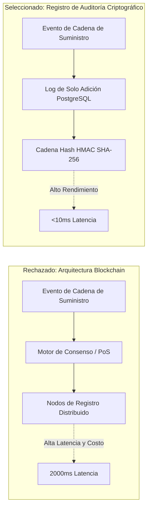

<!-- section:definition -->
## Contexto y Propuesta

Para mejorar la auditabilidad de la cadena de suministro y la inmutabilidad de datos entre proveedores, se presentó una propuesta para adoptar tecnologías de **Blockchain** públicas/privadas.

<!-- section:components -->
## Decisión (RECHAZADO)

Tras la evaluación técnica y las pruebas comparativas, la **propuesta de Blockchain fue RECHAZADA**. En su lugar, decidimos implementar un Registro de Auditoría Criptográfico basado en una tabla PostgreSQL de solo adición enlazada por hash.

<!-- section:data-flow -->
## Diagrama de Justificación (Comparativa Mermaid)

<!-- section:use-cases -->
## Opciones Evaluadas

1. **Blockchain Privada (Hyperledger Fabric):** Excesiva sobrecarga operativa, bajo rendimiento (TPS) e interfaces de consulta complejas.
2. **Registro de Auditoría Criptográfico (Seleccionado):** Alto rendimiento, expresividad SQL estándar y costos operativos significativamente menores.

<!-- section:trade-offs -->
## Razones del Rechazo

### Factores de Fallo
- **Alta Latencia:** Los mecanismos de consenso introdujeron retrasos en la confirmación de transacciones superiores a 2,000 ms.
- **Supuestos de Confianza Erróneos:** Todos los proveedores participantes ya confían en nuestro proveedor central de identidad; la tolerancia a fallos bizantinos no es necesaria.
- **Fricción para Desarrolladores:** Pérdida de herramientas de indexación, consulta y generación de informes SQL estándar.

<!-- section:production -->
## Solución Arquitectónica Alternativa

- Se implementó una tabla PostgreSQL de solo inserción donde cada nuevo registro incluye un hash HMAC SHA-256 enlazado al registro anterior.

<!-- section:security -->
## Verificación de Seguridad

- Cada entrada incluye una firma HMAC SHA-256, con verificaciones automatizadas diarias de integridad.

<!-- section:testing -->
## Resultados de Pruebas

- Las pruebas mostraron un cuello de botella en Blockchain a 150 TPS, mientras que la solución de cadena hash en PostgreSQL alcanzó 12,000 TPS.

<!-- section:observability -->
## Observabilidad

- Las alertas de detección de manipulación en tiempo real se envían mediante Prometheus a los paneles SIEM.

<!-- section:alternatives -->
## Arquitectura Seleccionada

- Cryptographic Audit Trail & Event Sourcing.

<!-- section:sources -->
## Fuentes

- ISO/IEC/IEEE 42010:2022 — Architecture Decision Records
- IEEE SWEBOK v4.0 — Data Architectures
