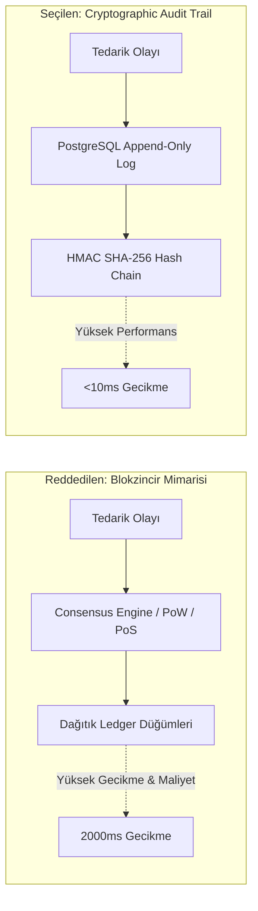

<!-- section:definition -->
## Bağlam ve Teklif (Context & Proposal)

Ürün ve tedarik zinciri izlenebilirliğini artırmak amacıyla, dağıtık katılımcılar arasında değişmezlik (immutability) sağlamak için public/private **Blokzincir (Blockchain)** teknolojisinin kullanılması önerilmiştir.

<!-- section:components -->
## Karar (Decision: RET EDİLDİ)

Yapılan PoC ve performans değerlendirmeleri sonucunda **Blokzincir teklifi RET EDİLMİŞTİR**. Bunun yerine, cryptographic hashing (HMAC/Merke Tree) içeren standart ilişkisel veritabanı (PostgreSQL append-only log) ve Audit Trail mimarisinin kullanılmasına karar verilmiştir.

<!-- section:data-flow -->
## Karar Gerekçelendirme Diyagramı (Mermaid Karşılaştırması)

<!-- section:use-cases -->
## Değerlendirilen Seçenekler

1. **Private Permissioned Blockchain (Hyperledger Fabric):** Yüksek operasyonel karmaşıklık, zayıf sorgulama imkanları ve saniyede düşük işlem sayısı (TPS).
2. **Kriptografik İmzalı Append-Only Log (Seçilen):** Yüksek throughput, SQL esnekliği ve katlarca düşük maliyet.

<!-- section:trade-offs -->
## Red Gerekçeleri (Cons & Failure Factors)

### Reddedilme Nedenleri
- **Aşırı Gecikme (Latency Overhead):** Konsensus mekanizmaları işlem onay sürelerini 2 saniyenin üzerine çıkarmaktadır.
- **Güven Modeli Gerçeği:** Katılımcı tüm firmalar merkezi kimlik doğrulama otoritemize zaten güvenmektedir; byzantine fault tolerance gereksizdir.
- **Geliştirici Deneyimi:** SQL ekosisteminin sunduğu zengin indeksleme ve raporlama imkanlarının kaybolması.

<!-- section:production -->
## Alternatif Mimari Çözüm

- PostgreSQL üzerinde yalnızca ekleme yapılabilen (`INSERT` only) ve önceki satırın hash değerini bir sonraki satıra bağlayan (Hash Chain) denetim izi tablosu kurulmuştur.

<!-- section:security -->
## Güvenlik Doğrulaması

- Her kaydın HMAC SHA-256 imzası saklanmakta ve veritabanı yedeğinde tutarlılık rutin olarak doğrulanmaktadır.

<!-- section:testing -->
## Test Sonuçları

- PoC testlerinde Blokzincir 150 TPS seviyesinde tıkanırken, PostgreSQL Hash Chain çözümü 12,000 TPS değerine ulaşmıştır.

<!-- section:observability -->
## Gözlemlenebilirlik

- Hash bozulma (tampering) uyarıları Prometheus üzerinden SIEM panellerine bağlanmıştır.

<!-- section:alternatives -->
## Önerilen Mimari

- Cryptographic Audit Trail & Event Sourcing.

<!-- section:sources -->
## Kaynaklar

- ISO/IEC/IEEE 42010:2022 — Architecture Decision Records
- IEEE SWEBOK v4.0 — Data Architectures
