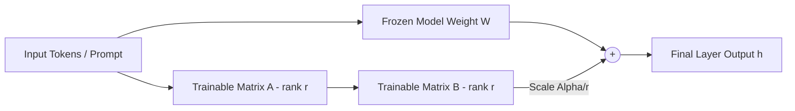

<!-- section:definition -->
## Definition and Problem Statement

Parameter-Efficient Fine-Tuning (PEFT) and Low-Rank Adaptation (LoRA) freeze the pre-trained Large Language Model (LLM) weights and inject trainable rank decomposition matrices into Transformer layers.

Full Fine-Tuning requires massive VRAM footprint and expensive GPU clusters. QLoRA leverages 4-bit NormalFloat (NF4) quantization and double quantization to enable domain-specific fine-tuning on consumer GPUs without accuracy loss.

<!-- section:components -->
## Core Components

- **Frozen Base Model:** Frozen pre-trained transformer model parameters (e.g., Llama-3 8B/70B).
- **LoRA Adapters (Low-Rank Matrices A & B):** $d \times r$ and $r \times d$ trainable matrices where rank $r \ll d$.
- **Quantization Engine (QLoRA):** Quantizes base weights into 4-bit NF4 format with Paged Optimizers for memory spike management.
- **PEFT Controller (Hugging Face PEFT):** Orchestrates dynamic adapter loading and weights merging during inference.

<!-- section:model-data-flow -->
## Model & Data Flow (LoRA Mermaid Flowchart)

<!-- section:evaluation -->
## Evaluation and Metrics

- **VRAM Savings:** Reduces GPU memory usage by 60–80% during fine-tuning.
- **Mitigating Catastrophic Forgetting:** Preserves base model capabilities while acquiring specialized domain skills.

<!-- section:security -->
## Security Concerns

- Scan custom adapter weights (`safetensors`) for data poisoning or malicious instruction injection.

<!-- section:cost -->
## Cost Analysis

- Replaces expensive 8x A100 GPU clusters with single-GPU training workflows using QLoRA.

<!-- section:serving -->
## Serving Strategies

- **Multi-Tenant LoRA Serving:** Serve hundreds of domain-specific adapters concurrently on a single shared base model instance (e.g., vLLM multi-LoRA).

<!-- section:sources -->
## Sources

- Edward J. Hu et al. — *LoRA: Low-Rank Adaptation of Large Language Models (arXiv 2021)*
- Tim Dettmers et al. — *QLoRA: Efficient Finetuning of Quantized LLMs (NeurIPS 2023)*
