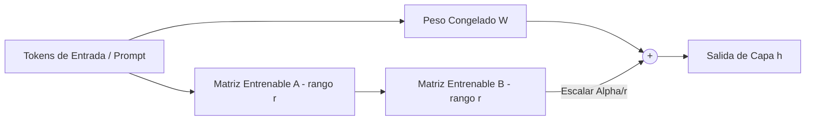

<!-- section:definition -->
## Definición y Descripción del Problema

El Ajuste Fino Eficiente en Parámetros (PEFT) y la Adaptación de Bajo Rango (LoRA) congelan los pesos de los Modelos de Lenguaje Grandes (LLM) e inyectan matrices de descomposición de bajo rango entrenables en las capas Transformer.

El ajuste fino completo requiere gran cantidad de memoria VRAM y clusters de GPU costosos. QLoRA utiliza cuantización de 4 bits NormalFloat (NF4) para permitir la adaptación en GPUs de consumo sin pérdida de precisión.

<!-- section:components -->
## Componentes Principales

- **Modelo Base Congelado:** Parámetros del modelo preentrenado mantenidos fijos (ej. Llama-3 8B/70B).
- **Adaptadores LoRA (Matrices A y B):** Matrices entrenables de dimensiones $d \times r$ y $r \times d$ donde el rango $r \ll d$.
- **Motor de Cuantización (QLoRA):** Cuantiza pesos base a formato 4 bits NF4 con optimizadores paginados.
- **Controlador PEFT (Hugging Face PEFT):** Orquesta la carga dinámica de adaptadores y la fusión de pesos en inferencia.

<!-- section:model-data-flow -->
## Flujo de Modelo y Datos (Diagrama Mermaid)

<!-- section:evaluation -->
## Evaluación y Métricas

- **Ahorro de VRAM:** Reduce el uso de memoria GPU entre un 60% y un 80% durante el entrenamiento.
- **Prevención del Olvido Catastrófico:** Preserva las capacidades del modelo base mientras adquiere habilidades específicas del dominio.

<!-- section:security -->
## Consideraciones de Seguridad

- Inspeccionar los archivos de adaptadores (`safetensors`) para evitar envenenamiento de datos o instrucciones maliciosas.

<!-- section:cost -->
## Análisis de Costos

- Reemplaza clusters de GPUs A100 costosos por flujos de trabajo en una sola GPU utilizando QLoRA.

<!-- section:serving -->
## Estrategias de Servicio (Serving)

- **Servicio LoRA Multinquilino:** Servir cientos de adaptadores específicos de forma concurrente sobre una sola instancia de modelo base compartida.

<!-- section:sources -->
## Fuentes

- Edward J. Hu et al. — *LoRA: Low-Rank Adaptation of Large Language Models (arXiv 2021)*
- Tim Dettmers et al. — *QLoRA: Efficient Finetuning of Quantized LLMs (NeurIPS 2023)*
