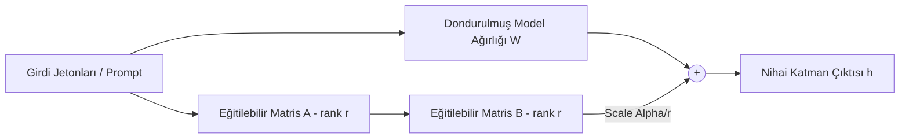

<!-- section:definition -->
## Tanım ve Çözdüğü Problem

Parametre Verimli İnce Ayar (Parameter-Efficient Fine-Tuning / PEFT) ve LoRA (Low-Rank Adaptation); milyarlarca parametreye sahip Büyük Dil Modellerinin (LLM) tüm ağırlıklarını dondurarak (freeze), modele yalnızca küçük katmanlar (rank decomposition matrices) ekleyip eğiten yapay zeka mimarisidir.

Tam İnce Ayar (Full Fine-Tuning) devasa GPU belleği (VRAM) ve yüksek işlem gücü gerektirir. QLoRA mimarisi 4-bit NormalFloat (NF4) kuantizasyonu kullanarak tüketici seviyesi GPU'larda dahi modellerin alana özgü adapte edilmesini sağlar.

<!-- section:components -->
## Temel Bileşenler

- **Frozen Base Model:** Eğitimi durdurulmuş, sabit tutulan ana model ağırlıkları (ör. Llama-3 8B / 70B).
- **LoRA Adapter (Low-Rank Matrices A & B):** $d \times r$ ve $r \times d$ boyutlarında ($r \ll d$), eğitilebilir düşük rütbeli matrisler.
- **Quantization Engine (QLoRA):** Ana model ağırlıklarını 4-bit FP4/NF4 biçiminde sıkıştıran ve Paged Optimizer kullanan bileşen.
- **PEFT Controller (Hugging Face PEFT):** Adaptör ağırlıklarını ana modele dinamik ekleyen ve çıkarım (inference) anında birleştiren (merge) altyapı.

<!-- section:model-data-flow -->
## Model ve Veri Akışı (LoRA Mermaid Akışı)

<!-- section:evaluation -->
## Değerlendirme ve Metrikler

- **VRAM Tasarrufu:** %60-80 oranında daha az GPU belleği kullanımı.
- **Catastrophic Forgetting:** Ana modelin genel yeteneklerini kaybetme riskinin LoRA ile minimize edilmesi.

<!-- section:security -->
## Güvenlik Kaygıları

- Adaptör dosyalarının (safetensors) içine kötü amaçlı kod veya zehirlenmiş veri (data poisoning) eklenme riski denetlenmelidir.

<!-- section:cost -->
## Maliyet Analizi

- Full fine-tuning için 8x A100 GPU gerekirken, QLoRA ile tek bir RTX 4090 GPU üzerinde eğitim tamamlanabilir.

<!-- section:serving -->
## Servis Etme (Serving Stratejileri)

- **Multi-Tenant LoRA Serving:** Tek bir dondurulmuş ana model üzerinde farklı kullanıcılar için yüzlerce küçük LoRA adaptörünü dinamik olarak yükleyip çalıştırma (ör. vLLM multi-LoRA).

<!-- section:sources -->
## Kaynaklar

- Edward J. Hu et al. — *LoRA: Low-Rank Adaptation of Large Language Models (arXiv 2021)*
- Tim Dettmers et al. — *QLoRA: Efficient Finetuning of Quantized LLMs (NeurIPS 2023)*
