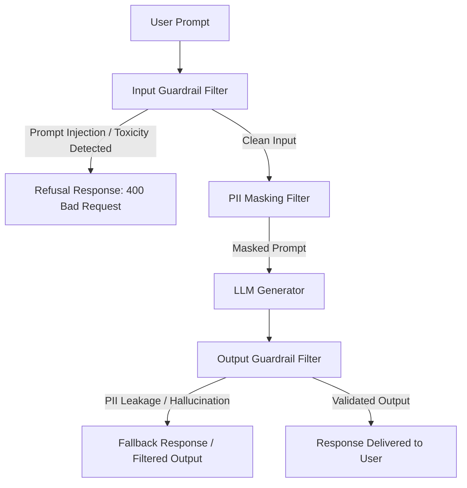

<!-- section:definition -->
## Definition and Problem Statement

LLM Guardrails Architecture is a dedicated security layer evaluating user inputs (Input Guardrails) and model generations (Output Guardrails) in real-time to enforce safety boundaries, structural integrity, and regulatory compliance.

Due to their probabilistic nature, Large Language Models are vulnerable to Prompt Injection, PII Data Exfiltration, System Prompt Leakage, and Hallucinations (OWASP LLM Top 10). Guardrails mitigate these risks deterministically.

<!-- section:components -->
## Core Components

- **Input Classifier Guardrail:** Pre-execution filter evaluating inputs for Prompt Injection, Jailbreak attempts, and toxic content (e.g., Llama Guard, NeMo Guardrails).
- **PII Anonymizer Engine:** Masks sensitive identifiers (SSN, credit cards, emails) before prompts reach the LLM provider (e.g., Microsoft Presidio).
- **Output Validation Engine:** Post-execution inspector enforcing output schemas, verifying RAG faithfulness, and detecting hallucinated facts.
- **Fallback Handler:** Deterministic policy engine returning safe refusal responses when policy violations occur.

<!-- section:model-data-flow -->
## Model & Data Flow (Guardrails Mermaid Flowchart)

<!-- section:evaluation -->
## Evaluation and Metrics

- **False Positive Rate:** Ensure benign user queries are incorrectly flagged at rates <0.1%.
- **Latency Overhead:** Total inspection overhead across input and output guardrail passes must remain under 50ms.

<!-- section:security -->
## Security Concerns

- Guardrail classification models themselves must be regularly updated to defend against novel Indirect Prompt Injection vectors (OWASP LLM01:2025).

<!-- section:cost -->
## Cost Analysis

- Use lightweight classifier models (e.g., DeBERTa, Llama-Guard 3B) to minimize latency and token processing costs relative to main LLM invocations.

<!-- section:serving -->
## Serving Strategies

- **Sidecar / Gateway Guardrail Pattern:** Deploy guardrails as independent proxy services within an API Gateway or Envoy sidecar.

<!-- section:sources -->
## Sources

- OWASP Top 10 for Large Language Model Applications v2.0
- NIST AI Risk Management Framework 1.0 (AI RMF)
