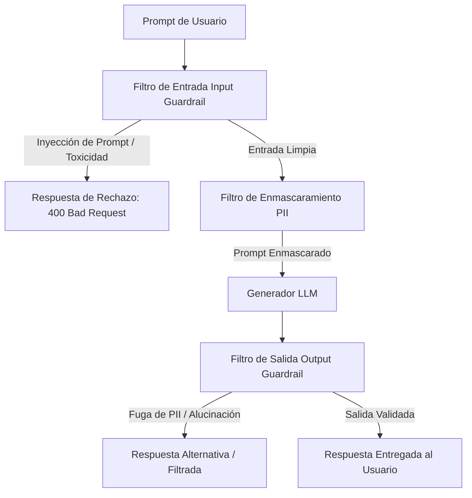

<!-- section:definition -->
## Definición y Descripción del Problema

La Arquitectura de Barreras de Seguridad para LLM (LLM Guardrails) es una capa de seguridad dedicada a evaluar en tiempo real las entradas de los usuarios (Input Guardrails) y las salidas de los modelos (Output Guardrails) para garantizar el cumplimiento de políticas de seguridad.

Debido a su naturaleza probabilística, los Modelos de Lenguaje Grandes son vulnerables a Inyecciones de Prompts, Fugas de Datos Personales (PII), Fugas del Prompt del Sistema y Alucinaciones (OWASP LLM Top 10). Las barreras de seguridad mitigan estos riesgos.

<!-- section:components -->
## Componentes Principales

- **Filtro de Entradas (Input Guardrail):** Evalúa entradas antes de su ejecución para detectar Inyecciones de Prompts, Jailbreaks y contenido tóxico.
- **Motor de Anonimización PII:** Enmascara identificadores sensibles (DNI, tarjetas, correos) antes de que el prompt llegue al modelo.
- **Validador de Salidas (Output Guardrail):** Inspecciona respuestas asegurando esquemas correctos, veracidad en RAG y ausencia de alucinaciones.
- **Manejador de Respuestas Seguras:** Devuelve respuestas de rechazo seguras ante violaciones de políticas.

<!-- section:model-data-flow -->
## Flujo de Modelo y Datos (Diagrama Mermaid)

<!-- section:evaluation -->
## Evaluación y Métricas

- **Tasa de Falsos Positivos:** Garantizar que las consultas legítimas se bloqueen a una tasa <0.1%.
- **Latencia Adicional:** El tiempo de inspección total debe ser inferior a 50 ms.

<!-- section:security -->
## Consideraciones de Seguridad

- Los modelos clasificadores deben actualizarse continuamente para defenderse contra nuevas técnicas de Inyección Indirecta de Prompts (OWASP LLM01:2025).

<!-- section:cost -->
## Análisis de Costos

- Utilizar modelos clasificadores ligeros (ej. DeBERTa, Llama-Guard 3B) para minimizar el impacto en latencia y costo de tokens.

<!-- section:serving -->
## Estrategias de Servicio (Serving)

- **Patrón Gateway / Sidecar Guardrail:** Desplegar las barreras de seguridad como servicios proxy independientes dentro de un API Gateway o sidecar Envoy.

<!-- section:sources -->
## Fuentes

- OWASP Top 10 for Large Language Model Applications v2.0
- NIST AI Risk Management Framework 1.0 (AI RMF)
