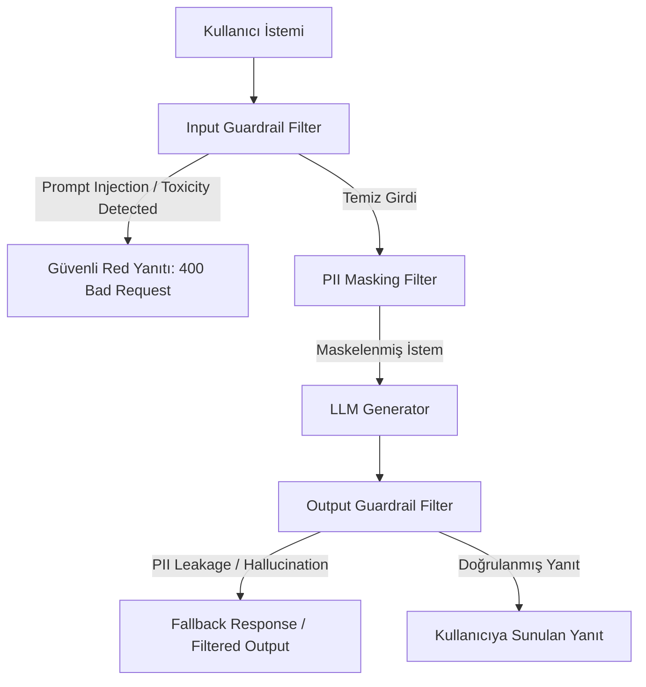

<!-- section:definition -->
## Tanım ve Çözdüğü Problem

LLM Güvenlik Duvarları (LLM Guardrails Architecture); Üretken Yapay Zeka uygulamalarında istemci girdilerini (Input Guardrails) ve model yanıtlarını (Output Guardrails) gerçek zamanlı denetleyen, süzgeçten geçiren ve güvenli sınırlar içerisinde tutan güvenlik katmanıdır.

Büyük Dil Modelleri stokastik yapıları gereği Prompt Injection (zararlı komut sızdırma), Hassas Veri Sızıntısı (PII Exfiltration), Halüsinasyon ve Sistem Talimatlarını İhlal Etme (System Prompt Leakage) gibi OWASP LLM Top 10 risklerine açıktır. Guardrails bu riskleri proaktif engeller.

<!-- section:components -->
## Temel Bileşenler

- **Input Classifier Guardrail:** Kullanıcı istemlerini Prompt Injection, Jailbreak ve toksik söylemlere karşı analiz eden ön denetleyici (ör. Llama Guard, NeMo Guardrails).
- **PII Anonymizer Engine:** TCKN, Kredi Kartı, e-posta gibi kişisel verileri istem modele gitmeden önce maskeleyen/anonimleştiren bileşen (ör. Microsoft Presidio).
- **Output Validation Engine:** Model çıktısını halüsinasyon, kaynak sadakati (RAG Faithfulness) ve format doğrulaması (JSON Schema) yönünden denetleyen arka kontrolcü.
- **Fall-back Handler:** Zararlı veya uygunsuz bir istek tespit edildiğinde güvenli varsayılan yanıtı (Redirection/Refusal) döndüren mekanizma.

<!-- section:model-data-flow -->
## Model ve Veri Akışı (Guardrails Mermaid Akışı)

<!-- section:evaluation -->
## Değerlendirme ve Metrikler

- **True Positive / False Positive Oranı:** Meşru kullanıcı isteklerinin yanlışlıkla engellenme (false positive) oranı <%0.1 olmalıdır.
- **Latency Impact:** Guardrail katmanlarının toplam yanıt süresine etkisi <50ms seviyesinde tutulmalıdır.

<!-- section:security -->
## Güvenlik Kaygıları

- Guardrail kurallarının kendisi de Indirect Prompt Injection saldırılarına karşı güncel tutulmalıdır (OWASP LLM01:2025).

<!-- section:cost -->
## Maliyet Analizi

- Hafif sınıflandırıcı küçük modeller (ör. DeBERTa, Llama-Guard 3B) kullanılarak ana LLM maliyeti ve gecikmesi artırılmadan güvenlik sağlanmalıdır.

<!-- section:serving -->
## Servis Etme (Serving Stratejileri)

- **Sidecar / Gateway Guardrail Pattern:** Guardrail denetimlerini API Gateway veya proxy seviyesinde bağımsız bir servis olarak konuşlandırma.

<!-- section:sources -->
## Kaynaklar

- OWASP Top 10 for Large Language Model Applications v2.0
- NIST AI Risk Management Framework 1.0 (AI RMF)
