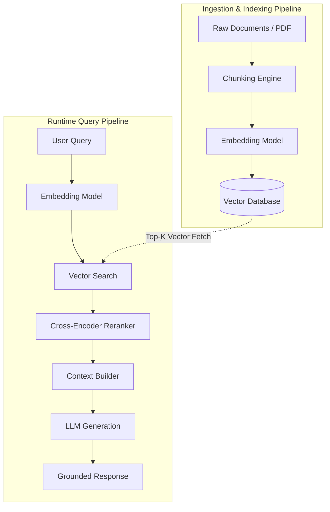

<!-- section:definition -->
## Definition and Problem Statement

Retrieval-Augmented Generation (RAG) is an AI architectural pattern where Large Language Models (LLMs) dynamically retrieve relevant context from external knowledge stores (vector databases, document repositories, relational databases) prior to generating responses.

LLMs trained on static datasets risk hallucination or generating outdated responses. RAG enables verifiable, domain-specific generation backed by enterprise data without expensive model retraining.

<!-- section:components -->
## Core Components

- **Ingestion Pipeline:** Loads documents, splits text into chunks, and computes vector embeddings.
- **Vector Database:** Stores embeddings with HNSW or IVF indices and provides similarity search (Cosine/Euclidean) (e.g., Qdrant, pgvector).
- **Retriever & Reranker:** Fetches top-K candidate chunks and reranks them using semantic relevance models (Cross-Encoders).
- **LLM Generator:** Combines the user query with retrieved context to generate grounded responses.

<!-- section:data-flow -->
## Data & Control Flow (Mermaid Flowchart)

<!-- section:use-cases -->
## Use Cases and Trade-offs

### Primary Use Cases
- **Enterprise Knowledge Base:** Internal HR portals, technical documentation, and customer support.
- **Frequently Changing Data:** Financial analysis and regulatory compliance reporting.

<!-- section:trade-offs -->
### Architectural Trade-offs
- **Query Latency:** Vector search and reranking add 200–500ms overhead to response generation.
- **Context Window Constraints:** Context length directly influences token costs and attention density.

<!-- section:production -->
## Production & Operational Considerations

1. **Chunking Strategy:** Balancing chunk size (e.g., 512 tokens) and overlap prevents semantic fragmentation.
2. **Hybrid Search:** Combining Dense Vector Search with Sparse BM25 Keyword Search improves retrieval recall.

<!-- section:security -->
## Security Concerns

- **Document Access Control (ACLs):** Filter retrieved chunks based on user authorization policies prior to prompt construction.
- **Prompt Injection:** Sanitize retrieved external context against malicious prompt injection payloads.

<!-- section:testing -->
## Testing and Validation

- Automate evaluation using **RAGAS Metrics**: Faithfulness, Context Relevance, and Answer Relevance.

<!-- section:observability -->
## Observability

- Track vector search latency, embedding generation time, and token consumption using LangSmith or OpenTelemetry.

<!-- section:alternatives -->
## Alternatives

- **Fine-Tuning:** For domain style adaptation (not suitable for rapidly changing facts).
- **Long-Context Prompting:** Injecting raw document sets directly for small corpus sizes.

<!-- section:sources -->
## Sources

- NIST AI Risk Management Framework (AI RMF 1.0)
- IEEE SWEBOK v4.0 — Artificial Intelligence Knowledge Area
