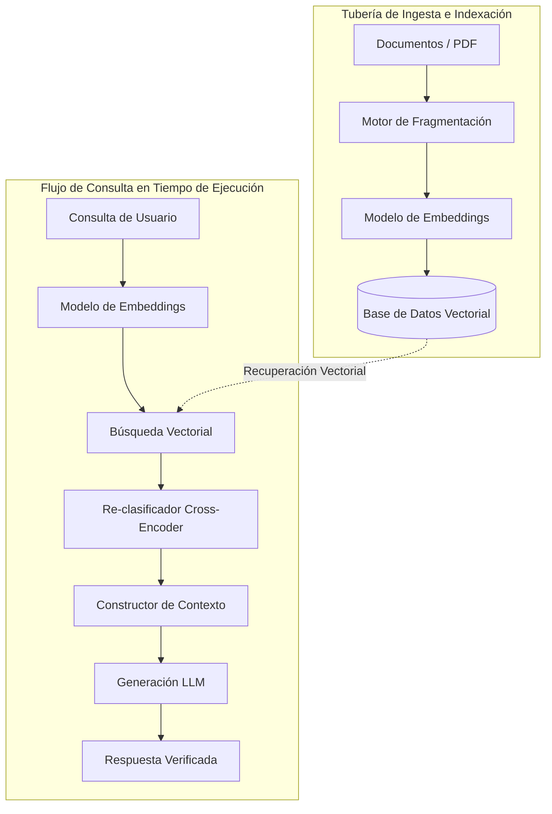

<!-- section:definition -->
## Definición y Descripción del Problema

La Generación Aumentada por Recuperación (RAG) es un patrón arquitectónico de IA mediante el cual los Modelos de Lenguaje Grandes (LLM) recuperan dinámicamente contexto relevante de fuentes externas (bases de datos vectoriales, repositorios documentales) antes de generar una respuesta.

Los modelos entrenados en datos estáticos corren el riesgo de generar alucinaciones o respuestas desactualizadas. RAG permite generar respuestas verificables y específicas del dominio sin necesidad de reentrenar el modelo.

<!-- section:components -->
## Componentes Principales

- **Ingestion Pipeline:** Carga documentos, realiza fragmentación (chunking) y genera representaciones vectoriales (embeddings).
- **Base de Datos Vectorial:** Almacena embeddings con índices HNSW o IVF y ofrece búsqueda por similitud (ej. Qdrant, pgvector).
- **Recuperador y Re-clasificador (Reranker):** Obtiene los fragmentos más relevantes y los reordena por relevancia semántica mediante Cross-Encoders.
- **Generador LLM:** Combina la consulta con el contexto recuperado para generar respuestas fundamentadas.

<!-- section:data-flow -->
## Flujo de Datos y Control (Diagrama Mermaid)

<!-- section:use-cases -->
## Casos de Uso y Compromisos

### Casos de Uso Principales
- **Base de Conocimiento Empresarial:** Portales de soporte, documentación técnica y manuales internos.
- **Datos Dinámicos:** Informes financieros y actualizaciones normativas.

<!-- section:trade-offs -->
### Compromisos (Trade-offs)
- **Latencia de Consulta:** La búsqueda vectorial y el reordenamiento añaden de 200 a 500 ms de latencia.
- **Límite de Ventana de Contexto:** La longitud del contexto influye en el costo y la atención del modelo.

<!-- section:production -->
## Desafíos Operativos y de Producción

1. **Estrategia de Fragmentación:** Ajustar el tamaño del fragmento (ej. 512 tokens) y la superposición evita la pérdida semántica.
2. **Búsqueda Híbrida:** Combinar búsqueda vectorial densa con búsqueda por palabras clave dispersa (BM25) mejora la precisión.

<!-- section:security -->
## Consideraciones de Seguridad

- **Control de Acceso a Documentos (ACL):** Filtrar los fragmentos recuperados según los permisos del usuario.
- **Inyección de Prompts:** Sanear el contexto externo para evitar ejecuciones maliciosas de instrucciones en el LLM.

<!-- section:testing -->
## Pruebas y Validación

- Automatizar la evaluación con **Métricas RAGAS**: Fidelidad, Relevancia del Contexto y Relevancia de la Respuesta.

<!-- section:observability -->
## Observabilidad

- Monitorizar la latencia de búsqueda, la generación de embeddings y el consumo de tokens en paneles LangSmith u OpenTelemetry.

<!-- section:alternatives -->
## Alternativas

- **Fine-Tuning:** Para adaptación de estilo o lenguaje del dominio.
- **Prompting de Largo Contexto:** Inyectar conjuntos de documentos directamente para volúmenes reducidos.

<!-- section:sources -->
## Fuentes

- NIST AI Risk Management Framework (AI RMF 1.0)
- IEEE SWEBOK v4.0 — Artificial Intelligence Knowledge Area
