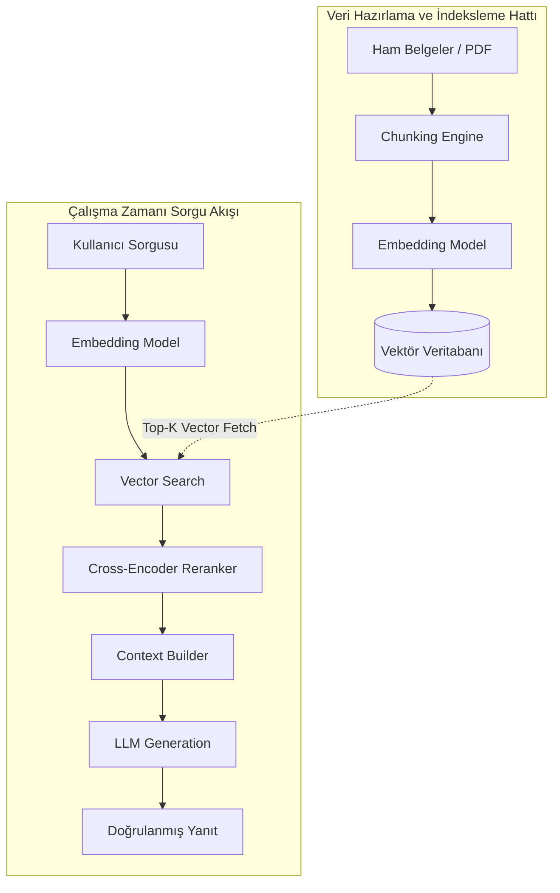

<!-- section:definition -->
## Tanım ve Çözdüğü Problem

Retrieval-Augmented Generation (RAG); Büyük Dil Modellerinin (LLM) yanıt üretmeden önce dış bilgi kaynaklarından (vektör veritabanları, doküman depoları, ilişkisel veritabanları) dinamik olarak en ilgili bağlamı sorgulayıp istem (prompt) içerisine dahil ettiği yapay zeka mimari kalıbıdır.

Büyük Dil Modelleri kapalı eğitim verileri nedeniyle güncel olmayan veya yanlış bilgi üretme (hallucination) riski taşır. RAG mimarisi, modeli yeniden eğitmeye (retraining) gerek kalmadan kurumsal verilerle dinamik ve doğrulanabilir yanıtlar üretmesini sağlar.

<!-- section:components -->
## Temel Bileşenler

- **Ingestion Pipeline:** Belgeleri yükleyen, küçük parçalara (chunking) bölen ve vektör temsillerini (embeddings) üreten veri hattı.
- **Vector Database:** Vektör gömülerini HNSW veya IVF indeksleri ile saklayan ve benzerlik arama (Cosine / Euclidean) imkanı sunan veritabanı (ör. Qdrant, pgvector).
- **Retriever & Reranker:** İstemci sorgusuna en yakın doküman parçalarını getiren ve ikinci aşamada anlamsal alaka sırasına dizen (Cross-Encoder / Cohere Rerank) bileşen.
- **LLM Generator:** Getirilen bağlamı ve kullanıcı talimatını birleştirip nihai yanıtı üreten üretken dil modeli.

<!-- section:data-flow -->
## Veri ve Kontrol Akışı (RAG Mermaid Akışı)

<!-- section:use-cases -->
## Kullanım Alanları ve Değiş-Tokuşlar

### Ideal Kullanım Alanları
- **Kurumsal Bilgi Bankası ve Chatbotlar:** İç politika dokümanları, teknik kılavuzlar ve müşteri destek sistemleri.
- **Dinamik ve Değişen Veriler:** Finansal raporlar ve mevzuat değişiklikleri gibi sürekli güncellenen veriler.

<!-- section:trade-offs -->
### Değiş-Tokuşlar (Trade-offs)
- **Sorgu Gecikmesi (Latency):** Vektör arama ve reranking adımları yanıt süresine 200-500ms ek yük getirir.
- **Bağlam Penceresi Sınırı (Context Window Limit):** Modele sunulan bağlamın uzunluğu maliyeti ve yanıt kalitesini etkiler.

<!-- section:production -->
## Üretim ve Operasyon Zorlukları

1. **Chunking Stratejisi:** Parça boyutu (ör. 512 token) ve örtüşme (overlap) oranının doğru ayarlanması bilgi kaybını önler.
2. **Hybrid Search:** Yanlış eşleşmeleri engellemek için Vektör Araması (Dense) ile Kelime Araması (Sparse / BM25) birleştirilmelidir (Hybrid RAG).

<!-- section:security -->
## Güvenlik Kaygıları

- **Erişim Denetimi (Document ACLs):** Kullanıcının görmeye yetkili olmadığı belgeler vektör arama aşamasında süzülmelidir.
- **Prompt Injection:** Bağlam içerisine gizlenmiş zararlı talimatların LLM tarafından yürütülmesi engellenmelidir.

<!-- section:testing -->
## Test ve Doğrulama

- **RAGAS Metrikleri:** Bağlam Sadakati (Faithfulness), Bağlam Alakası (Context Relevance) ve Yanıt Doğruluğu (Answer Relevance) metrikleri otomatize edilmelidir.

<!-- section:observability -->
## Gözlemlenebilirlik

- Vector DB arama süreleri, embedding üretim gecikmesi ve jeton kullanım maliyetleri LangSmith veya OpenTelemetry panellerinde izlenmelidir.

<!-- section:alternatives -->
## Alternatifler

- **Fine-Tuning:** Modelin stil ve alan dilini öğrenmesi istendiğinde (ancak bilgi güncellemek için uygun değildir).
- **Long-Context Prompting:** Küçük veri kümelerinde tüm belgeleri doğrudan modele besleme.

<!-- section:sources -->
## Kaynaklar

- NIST AI Risk Management Framework (AI RMF 1.0)
- IEEE SWEBOK v4.0 — Artificial Intelligence Knowledge Area
