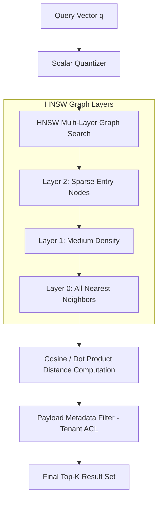

<!-- section:definition -->
## Definition and Problem Statement

Vector Databases are specialized storage systems designed to store, index, and query high-dimensional vector embeddings generated by AI models (e.g., 1536-dimensional OpenAI embeddings, 1024-dimensional Cohere embeddings). They execute sub-second Approximate Nearest Neighbor (ANN) similarity searches across massive datasets.

Traditional relational databases rely on exact matches (`WHERE` clauses) and cannot scale distance metrics (Cosine Similarity, Euclidean Distance, Inner Product) across millions of high-dimensional vectors.

<!-- section:components -->
## Core Components

- **Embedding Model Pipeline:** Preprocessing component converting raw unstructured inputs into dense vector arrays.
- **Vector Index Engine:** Constructs graph structures using algorithms like **HNSW (Hierarchical Navigable Small World)** or **IVF (Inverted File Index)**.
- **Quantization Layer (PQ / SQ):** Reduces vector memory footprints by up to 75% via Scalar or Product Quantization.
- **Metadata Filtering Engine:** Applies strict structured metadata filters (payload filtering / tenant ACLs) during vector graph traversals.

<!-- section:data-flow -->
## Data & Control Flow (HNSW / IVF Mermaid Diagram)

<!-- section:use-cases -->
## Use Cases and Trade-offs

### Primary Use Cases
- **Retrieval-Augmented Generation (RAG):** Fetching top-K semantically relevant document chunks for LLM prompts.
- **Semantic Search & Multimodal Retrieval:** Searching image, text, and audio corpora based on conceptual similarity.

<!-- section:trade-offs -->
### Architectural Trade-offs
- **High Memory Footprint:** HNSW indices require holding graph structures in RAM, creating substantial infrastructure costs.
- **Recall vs Latency:** Increasing HNSW search depth (`ef_search`) improves recall accuracy but increases query latency.

<!-- section:production -->
## Production & Operational Considerations

1. **Memory Optimization:** Use Disk-ANN or Scalar Quantization (SQ8) to cut RAM overhead for multi-billion vector indices.
2. **Cluster Sharding:** Partition vector collections across nodes in dedicated clusters (Qdrant, Milvus) for horizontal scale.

<!-- section:security -->
## Security Concerns

- Enforce tenant isolation via mandatory payload metadata filters in multi-tenant RAG environments.

<!-- section:testing -->
## Testing and Validation

- Benchmark vector index configurations against standard datasets (ANN-Benchmarks) targeting >95% Recall at <50ms p99 latency.

<!-- section:observability -->
## Observability

- Track index build latency, RAM utilization per index layer, and p99 query search speeds.

<!-- section:alternatives -->
## Alternatives

- **pgvector (PostgreSQL Extension):** Add vector search capabilities directly into existing relational Postgres databases.
- **Dedicated Vector DBs (Qdrant, Pinecone, Milvus):** High-throughput, purpose-built engines for massive vector scale.

<!-- section:sources -->
## Sources

- Yu. A. Malkov, D. A. Yashunin — *HNSW Approximate Nearest Neighbor Search (IEEE TPAMI 2018)*
- pgvector & Qdrant Official Architecture Specifications
