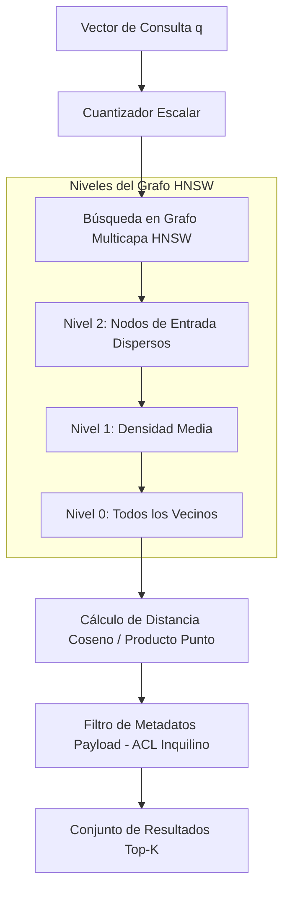

<!-- section:definition -->
## Definición y Descripción del Problema

Las Bases de Datos Vectoriales son sistemas de almacenamiento diseñados para almacenar, indexar y consultar embeddings de alta dimensión producidos por modelos de IA (ej. embeddings de 1536 dimensiones). Ejecutan búsquedas por similitud de Vecinos Más Cercanos Aproximados (ANN) en milisegundos.

Las bases de datos relacionales tradicionales se basan en coincidencias exactas y no pueden escalar métricas de distancia (Similitud Coseno, Distancia Euclidiana) en vectores de alta dimensión.

<!-- section:components -->
## Componentes Principales

- **Tubería de Modelos de Embeddings:** Componente de preprocesamiento que convierte entradas en vectores densos.
- **Motor de Índices Vectoriales:** Construye grafos utilizando algoritmos como **HNSW** o **IVF**.
- **Capa de Cuantización (PQ / SQ):** Reduce el consumo de memoria hasta un 75% mediante cuantización escalar o de producto.
- **Motor de Filtrado de Metadatos:** Aplica filtros estructurados (payload filtering) durante el recorrido del grafo.

<!-- section:data-flow -->
## Flujo de Datos y Control (Diagrama Mermaid)

<!-- section:use-cases -->
## Casos de Uso y Compromisos

### Casos de Uso Principales
- **RAG (Generación Aumentada por Recuperación):** Recuperar fragmentos de documentos semánticamente relevantes para prompts de LLM.
- **Búsqueda Semántica:** Buscar en corpus de texto, imagen o audio según similitud conceptual.

<!-- section:trade-offs -->
### Compromisos (Trade-offs)
- **Alto Consumo de Memoria:** Los índices HNSW requieren mantener estructuras de grafo en RAM, lo que genera costos de infraestructura.
- **Precisión vs Latencia:** Aumentar la profundidad de búsqueda HNSW (`ef_search`) mejora la precisión pero incrementa la latencia.

<!-- section:production -->
## Desafíos Operativos y de Producción

1. **Optimización de Memoria:** Utilizar Disk-ANN o Cuantización Escalar (SQ8) para reducir el consumo de RAM.
2. **Fragmentación (Sharded Cluster):** Particionar colecciones vectoriales en múltiples nodos para escalar horizontalmente.

<!-- section:security -->
## Consideraciones de Seguridad

- Aplicar aislamiento por inquilino mediante filtros de metadatos obligatorios en entornos RAG multinquilino.

<!-- section:testing -->
## Pruebas y Validación

- Evaluar las configuraciones de índices comparándolas con benchmarks estándar (ANN-Benchmarks) buscando >95% de precisión con latencias <50ms.

<!-- section:observability -->
## Observabilidad

- Monitorizar el tiempo de construcción de índices, el uso de RAM por nivel de grafo y la latencia de búsqueda p99.

<!-- section:alternatives -->
## Alternativas

- **pgvector (Extensión PostgreSQL):** Añadir búsqueda vectorial directamente a bases de datos relacionales existentes.
- **Bases de Datos Vectoriales Dedicadas (Qdrant, Pinecone, Milvus):** Motores diseñados específicamente para volúmenes masivos.

<!-- section:sources -->
## Fuentes

- Yu. A. Malkov, D. A. Yashunin — *HNSW Approximate Nearest Neighbor Search (IEEE TPAMI 2018)*
- pgvector & Qdrant Official Architecture Specifications
