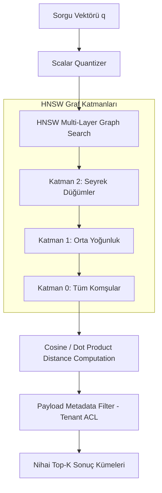

<!-- section:definition -->
## Tanım ve Çözdüğü Problem

Vektör Veritabanları (Vector Databases); metin, görsel, ses veya yapılandırılmamış verilerin yapay zeka modelleri (Embedding Models) tarafından üretilen yüksek boyutlu vektör temsillerini (ör. 1536 boyutlu OpenAI embeddings, 1024 boyutlu Cohere embeddings) saklamak, dizinlemek ve milisaniye seviyesinde Yaklaşık En Yakın Komşu (Approximate Nearest Neighbor / ANN) araması yapmak için tasarlanmış özel veritabanı sistemleridir.

Geleneksel ilişkisel veritabanları tam eşleşme (exact match / SQL WHERE) üzerine kuruludur ve yüksek boyutlu uzayda vektör mesafe hesaplamalarını (Cosine Similarity, Euclidean Distance, Inner Product) devasa veri kümelerinde ölçekleyemez.

<!-- section:components -->
## Temel Bileşenler

- **Embedding Model Integration:** Ham girdileri vektör dizilerine dönüştüren ön işleme katmanı.
- **Vector Index Engine:** Vektörleri hızlı sorgulamak için **HNSW (Hierarchical Navigable Small World)** veya **IVF (Inverted File Index)** grafları oluşturan dizinleme motoru.
- **Quantization Engine (PQ / Scalar Quantization):** Vektör boyutunu ve RAM kullanımını %75 azaltan kuantizasyon katmanı.
- **Filtered Search Engine (Payload Metadata):** Vektör aramasına eşzamanlı olarak metveri (payload filtering / JSON metadata) süzgeci uygulayan bileşen.

<!-- section:data-flow -->
## Veri ve Kontrol Akışı (HNSW / IVF Mermaid Şeması)

<!-- section:use-cases -->
## Kullanım Alanları ve Değiş-Tokuşlar

### Ideal Kullanım Alanları
- **RAG (Retrieval-Augmented Generation):** Bilgi depolarından anlamsal bağlam çekme.
- **Anlamsal Arama (Semantic Search):** Doğal dil ile doküman ve içerik arama.

<!-- section:trade-offs -->
### Değiş-Tokuşlar (Trade-offs)
- **Yüksek RAM Tüketimi:** HNSW graf indeksleri doğrudan RAM'de tutulduğu için büyük veri kümelerinde yüksek bellek maliyeti oluşur.
- **Recall vs Latency:** HNSW `ef_search` parametresi yükseltildiğinde doğruluk (recall) artar ancak arama gecikmesi yükselir.

<!-- section:production -->
## Üretim ve Operasyon Zorlukları

1. **Bellek Optimizasyonu:** RAM maliyetini düşürmek için Disk-ANN veya Product Quantization (PQ) kullanılmalıdır.
2. **Koleksiyon Parçalama (Sharding):** Milyarlarca vektör için Qdrant/Milvus kümeleri sharding ile ölçeklenmelidir.

<!-- section:security -->
## Güvenlik Kaygıları

- Multi-tenant vektör dizinlerinde kiracı bazlı yetkilendirme süzgeçleri (Payload ACL filters) sorgu aşamasında zorunlu tutulmalıdır.

<!-- section:testing -->
## Test ve Doğrulama

- Standart vektör veri kümeleri (ör. ANN-Benchmarks) ile %95+ Recall ve <50ms p99 gecikme hedefleri test edilmelidir.

<!-- section:observability -->
## Gözlemlenebilirlik

- Indeks oluşturma süresi (Build Latency), HNSW katman derinliği ve bellek kullanımı izlenmelidir.

<!-- section:alternatives -->
## Alternatifler

- **pgvector (PostgreSQL Eklentisi):** Mevcut PostgreSQL veritabanına doğrudan vektör arama yeteneği ekleme.
- **Özel Vektör DB (Qdrant, Pinecone, Milvus):** Milyarlarca vektör için yüksek performanslı bağımsız motorlar.

<!-- section:sources -->
## Kaynaklar

- Yu. A. Malkov, D. A. Yashunin — *HNSW Approximate Nearest Neighbor Search (IEEE TPAMI 2018)*
- pgvector & Qdrant Official Architecture Specifications
