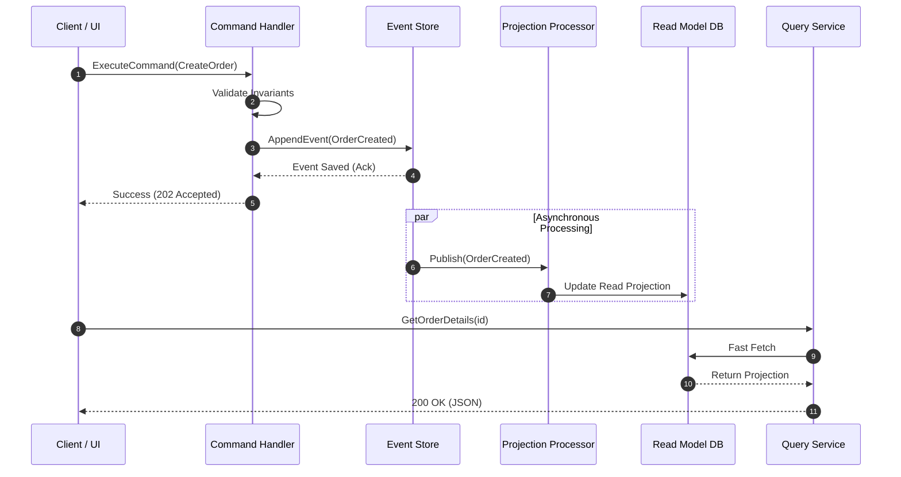

<!-- section:definition -->
## Definition and Problem Statement

CQRS (Command Query Responsibility Segregation) and Event Sourcing is a distributed architectural pattern that completely segregates read (Query) operations from write/mutation (Command) operations using distinct object models, data stores, and scaling strategies.

In traditional CRUD architectures, a single data model handles both business rule validation and complex queries. Under heavy traffic, this causes lock contention, data inconsistency, and scaling bottlenecks. CQRS and Event Sourcing decouple these concerns.

<!-- section:components -->
## Core Components

- **Command Service & Aggregate:** Validates business invariants and handles state mutation commands.
- **Event Store:** The primary append-only immutable event log storing every state change chronologically.
- **Event Handler / Projection Engine:** Asynchronous processors consuming events to build read projections.
- **Query Service & Read Model:** Denormalized, read-optimized data stores (e.g., Elasticsearch, Redis, PostgreSQL Read Replicas).

<!-- section:data-flow -->
## Data & Control Flow (Mermaid Diagram)

<!-- section:use-cases -->
## Use Cases and Trade-offs

### Primary Use Cases
- **Financial and Audit-Driven Systems:** Applications requiring account transaction history and full auditability.
- **High Read/Write Asymmetry:** E-commerce and social platforms where read traffic dominates write traffic 100:1.
- **Complex Domain Logic (DDD):** Bounded contexts with intricate business rules.

<!-- section:trade-offs -->
### Architectural Trade-offs
- **Increased Complexity:** Dual data models and asynchronous pipeline management.
- **Eventual Consistency:** Read projections lag behind event publication by a few milliseconds.

<!-- section:production -->
## Production & Operational Considerations

1. **Snapshotting:** Replaying long event streams slows aggregate hydration; periodic snapshots are mandatory.
2. **Schema Evolution:** Backward compatibility (upcasters/event versioning) is required when event payload schemas evolve.
3. **Idempotency:** Projection consumers must guarantee idempotent execution upon duplicate message delivery.

<!-- section:security -->
## Security Concerns

- **Event Store Immutability:** Event logs must be append-only with strict write/delete permissions.
- **Data Privacy (GDPR / KVKK):** Personal data compliance requires key-shredding (crypto-shredding) for event payloads.

<!-- section:testing -->
## Testing and Validation

- **Given-When-Then Pattern:** Unit tests must validate `Given(Past Events) -> When(New Command) -> Then(Expected New Events)`.

<!-- section:observability -->
## Observability

- Monitor projection lag and event queue depth using Prometheus/Grafana dashboards.

<!-- section:alternatives -->
## Alternatives

- **Monolithic CRUD:** For low-complexity, low-traffic domains.
- **Transactional Outbox + Relational DB:** CQRS implementation without full Event Sourcing.

<!-- section:sources -->
## Sources

- Martin Fowler — *CQRS Pattern & Event Sourcing*
- IEEE SWEBOK v4.0 — Software Architecture Knowledge
