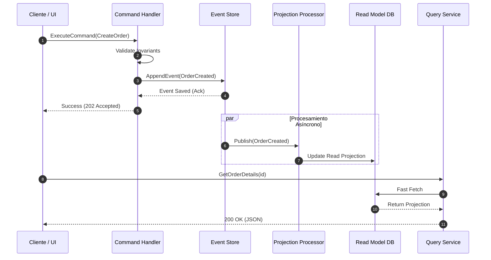

<!-- section:definition -->
## Definición y Descripción del Problema

CQRS (Command Query Responsibility Segregation) y Event Sourcing es un patrón de arquitectura distribuida que separa completamente las operaciones de lectura (Query) de las mutaciones de datos (Command) mediante modelos de objetos, almacenes de datos y estrategias de escalado independientes.

En las arquitecturas CRUD tradicionales, un único modelo maneja tanto la validación de reglas de negocio como las consultas complejas. Con tráfico elevado, esto genera bloqueos, inconsistencias y cuellos de botella de escalabilidad. CQRS y Event Sourcing desacoplan estas responsabilidades.

<!-- section:components -->
## Componentes Principales

- **Command Service & Aggregate:** Valida reglas de negocio y procesa solicitudes de modificación.
- **Event Store:** Almacén primario de registros inmutables donde cada cambio se registra cronológicamente.
- **Event Handler / Projection Engine:** Procesadores asíncronos que consumen eventos para actualizar proyecciones de lectura.
- **Query Service & Read Model:** Vistas de datos desnormalizadas y optimizadas para lectura rápida (ej. Elasticsearch, Redis, Réplicas PostgreSQL).

<!-- section:data-flow -->
## Flujo de Datos y Control (Diagrama Mermaid)

<!-- section:use-cases -->
## Casos de Uso y Deberes de Escalabilidad

### Casos de Uso Principales
- **Sistemas Financieros y de Auditoría:** Aplicaciones que requieren historial completo de transacciones y trazabilidad.
- **Asimetría de Lectura/Escritura:** Plataformas de comercio electrónico y redes sociales donde la lectura supera la escritura 100:1.
- **Lógica de Dominio Compleja (DDD):** Contextos delimitados con reglas de negocio intrincadas.

<!-- section:trade-offs -->
### Compromisos (Trade-offs)
- **Mayor Complejidad:** Gestión de modelos duales y tuberías asíncronas.
- **Consistencia Eventual:** La proyección de lectura puede diferir unos milisegundos tras la publicación del evento.

<!-- section:production -->
## Desafíos Operativos y de Producción

1. **Snapshotting:** Recrear estados desde eventos antiguos ralentiza el aggregate; se requieren instantáneas periódicas.
2. **Evolución del Esquema:** Se requiere compatibilidad hacia atrás (upcasters) cuando evoluciona el esquema de eventos.
3. **Idempotencia:** Los procesadores de eventos deben garantizar ejecución idempotente ante entregas duplicadas.

<!-- section:security -->
## Consideraciones de Seguridad

- **Inmutabilidad del Event Store:** Registro de solo lectura/adición con permisos estrictos.
- **Privacidad de Datos (GDPR / KVKK):** El "Derecho al Olvido" exige la eliminación de claves criptográficas (crypto-shredding) para anonimizar datos.

<!-- section:testing -->
## Pruebas y Validación

- **Patrón Given-When-Then:** Las pruebas unitarias deben validar `Given(Eventos Pasados) -> When(Nuevo Comando) -> Then(Nuevos Eventos Esperados)`.

<!-- section:observability -->
## Observabilidad

- Monitorizar el retardo de proyección (Projection Lag) y la profundidad de la cola de eventos en paneles Prometheus/Grafana.

<!-- section:alternatives -->
## Alternativas

- **CRUD Monolítico:** Para dominios de baja complejidad y tráfico reducido.
- **Transactional Outbox + Base Relacional:** Implementación CQRS sin Event Sourcing completo.

<!-- section:sources -->
## Fuentes

- Martin Fowler — *CQRS Pattern & Event Sourcing*
- IEEE SWEBOK v4.0 — Software Architecture Knowledge
