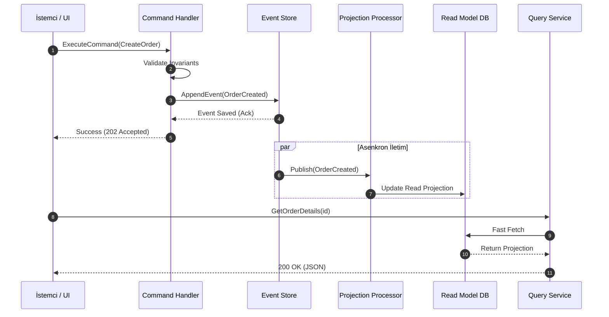

<!-- section:definition -->
## Tanım ve Çözdüğü Problem

CQRS (Command Query Responsibility Segregation) ve Event Sourcing; sistemdeki veri okuma (Query) operasyonları ile veri yazma/güncelleme (Command) operasyonlarını tamamen ayrı nesne modelleri, veri depoları ve ölçekleme stratejileri üzerinden yürüten dağıtık mimari kalıbıdır.

Geleneksel CRUD (Create, Read, Update, Delete) mimarilerinde tek bir veri nesnesi hem iş kurallarını doğrulamak hem de karmaşık sorguları yanıtlamak için kullanılır. Bu durum yüksek trafik altında kilitlenmelere, veri tutarsızlıklarına ve ölçekleme darboğazlarına yol açar. CQRS ve Event Sourcing bu karmaşıklığı ayrıştırır.

<!-- section:components -->
## Temel Bileşenler

- **Command Service & Aggregate:** İş kurallarını (invariants) doğrulayan ve durumu değiştiren mutasyon taleplerini işler.
- **Event Store:** Sistem durum değişikliklerinin salt-eklenir (append-only) değişmez (immutable) olaylar dizisi olarak saklandığı birincil veri deposudur.
- **Event Handler / Projection Engine:** Olayları dinleyerek okuma modellerini (Read Projections) güncelleyen asenkron işleyicilerdir.
- **Query Service & Read Model:** Hızlı ve denormalize okuma sorguları için optimize edilmiş salt-okunur veri görünümleridir (ör. Elasticsearch, Redis, PostgreSQL Read Replicas).

<!-- section:data-flow -->
## Veri ve Kontrol Akışı (Mermaid Şeması)

<!-- section:use-cases -->
## Kullanım Alanları ve Değiş-Tokuşlar

### Ideal Kullanım Alanları
- **Finansal ve Denetim Odaklı Sistemler:** Hesap hareketleri, bakiye geçmişi ve tam denetim izi (audit trail) gerektiren uygulamalar.
- **Yüksek Okuma/Yazma Oransızlığı:** Okuma taleplerinin yazma taleplerinden 100x fazla olduğu e-ticaret ve sosyal ağ sistemleri.
- **Karmaşık Alan Mantığı (DDD):** Karmaşık iş kurallarına sahip Bounded Context'ler.

<!-- section:trade-offs -->
### Değiş-Tokuşlar (Trade-offs)
- **Artan Karmaşıklık:** İki ayrı veri modeli ve asenkron iletim hattı yönetimi gerektirir.
- **Nihai Tutarlılık (Eventual Consistency):** Okuma modeli olay işlenene kadar birkaç milisaniye geriden gelebilir.

<!-- section:production -->
## Üretim ve Operasyon Zorlukları

1. **Snapshotting:** Event Store büyüdükçe aggregate durumunu sıfırdan hesaplamak yavaşlar; belirli aralıklarla snapshot alınmalıdır.
2. **Schema Evolution:** Olay veri yapısı değiştiğinde geriye dönük uyumluluk (upcasters/versioning) sağlanmalıdır.
3. **Idempotency:** Olay işleyiciler aynı olayı birden fazla kez alsa dahi veri tekrarı yaratmamalıdır.

<!-- section:security -->
## Güvenlik Kaygıları

- **Event Store Değişmezliği:** Olay günlüğü salt-eklenir olmalı, silme ve güncelleme yetkisi kısıtlanmalıdır.
- **Kişisel Veri (KVKK / GDPR):** "Unutulma Hakkı" için olay gövdesindeki hassas veriler kriptografik anahtar silme (crypto-shredding) yöntemiyle anonimleştirilmelidir.

<!-- section:testing -->
## Test ve Doğrulama

- **Given-When-Then Kalıbı:** `Given(Geçmiş Olaylar) -> When(Yeni Komut) -> Then(Beklenen Yeni Olaylar)` şeklinde birim testler yazılmalıdır.

<!-- section:observability -->
## Gözlemlenebilirlik

- Olay işleme gecikmesi (Projection Lag) ve Event Bus kuyruk derinliği Prometheus/Grafana panellerinde izlenmelidir.

<!-- section:alternatives -->
## Alternatifler

- **Monolitik CRUD:** Düşük karmaşıklıktaki ve düşük trafikli sistemler için.
- **Transactional Outbox + Traditional DB:** CQRS'in tam Event Sourcing olmadan uygulanması.

<!-- section:sources -->
## Kaynaklar

- Martin Fowler — *CQRS Pattern & Event Sourcing*
- IEEE SWEBOK v4.0 — Software Architecture Knowledge
