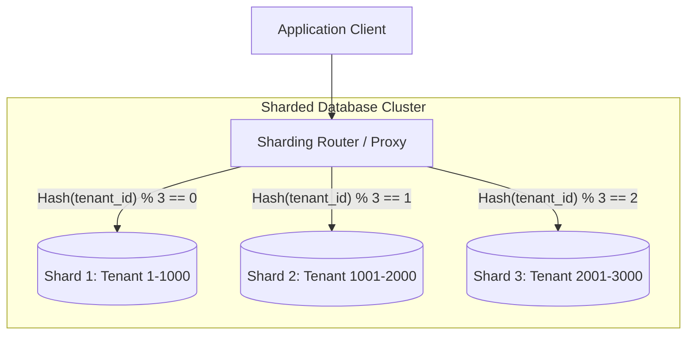

<!-- section:definition -->
## Definition and Problem Statement

Database Sharding is a horizontal data partitioning architecture that splits massive datasets and high-throughput query workloads across multiple autonomous database instances (shards) based on a defined **Shard Key**.

When vertical scaling (adding CPU/RAM) reaches physical or financial limits, sharding provides virtually unlimited horizontal scalability by distributing both storage and query processing.

<!-- section:components -->
## Core Components

- **Shard Key:** The mandatory attribute (e.g., `tenant_id`, `user_id`) that determines record assignment to specific shards.
- **Sharding Router / Proxy:** Intelligent middleware inspecting incoming queries and routing them to target shard nodes (e.g., Vitess, Citus, mongos).
- **Shard Nodes:** Autonomous relational or NoSQL database instances storing subsets of the total dataset.
- **Global Metadata Catalog:** Central registry storing shard key ranges and topology mapping rules.

<!-- section:data-flow -->
## Data & Control Flow (Mermaid Flowchart)

<!-- section:use-cases -->
## Use Cases and Trade-offs

### Primary Use Cases
- **Multi-Tenant SaaS Applications:** Partitioning tenant data isolates tenant footprints and guarantees predictable query performance.
- **High-Volume E-Commerce and Analytics:** Storing billions of transactions exceeding single-node disk or I/O limits.

<!-- section:trade-offs -->
### Architectural Trade-offs
- **Cross-Shard Query Overhead:** Queries missing the Shard Key require Scatter-Gather execution across all shards, introducing severe latency.
- **Resharding Complexity:** Adding new shard nodes requires complex data migration using consistent hashing algorithms.

<!-- section:production -->
## Production & Operational Considerations

1. **Shard Key Selection:** A poorly chosen Shard Key causes data skew and hotspotting on specific shard nodes.
2. **Distributed Secondary Indices:** Global lookup tables or secondary indices are required for non-shard-key queries.

<!-- section:security -->
## Security Concerns

- Enforce strict tenant isolation at the router level to prevent cross-tenant data leakage during query execution.

<!-- section:testing -->
## Testing and Validation

- Conduct failover tests to ensure that the failure of one shard node does not compromise the availability of adjacent shards.

<!-- section:observability -->
## Observability

- Monitor data distribution skew and query execution times across all shard nodes using Prometheus metrics.

<!-- section:alternatives -->
## Alternatives

- **Read Replicas:** Read-heavy workloads can scale by offloading queries to read replicas without sharding complexity.
- **Distributed SQL (NewSQL):** Modern engines (CockroachDB, TiDB) that manage transparent auto-sharding natively.

<!-- section:sources -->
## Sources

- PostgreSQL Official Documentation — Table Partitioning & Sharding
- MongoDB Manual — Sharded Cluster Architecture
