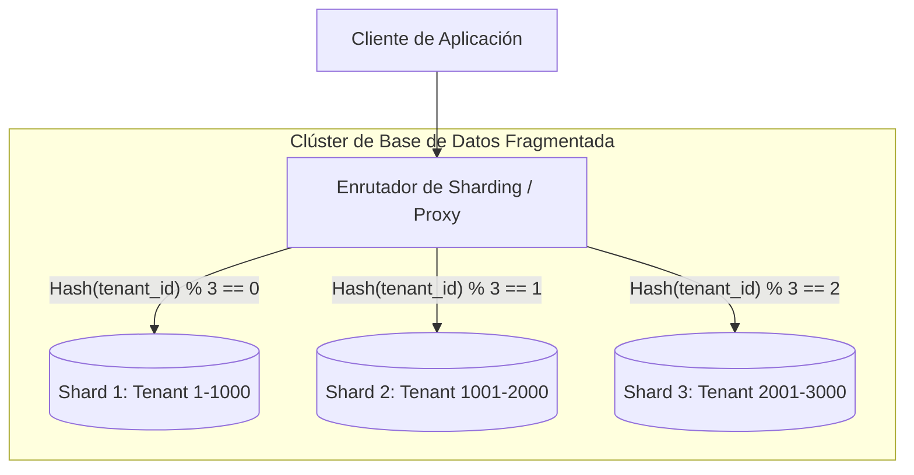

<!-- section:definition -->
## Definición y Descripción del Problema

El Sharding de Base de Datos es una arquitectura de particionamiento horizontal que divide grandes volúmenes de datos y cargas de trabajo entre múltiples instancias independientes (shards) según una **Clave de Fragmentación (Shard Key)**.

Cuando el escalado vertical alcanza límites físicos o económicos, el sharding proporciona escalabilidad horizontal prácticamente ilimitada al distribuir almacenamiento y procesamiento.

<!-- section:components -->
## Componentes Principales

- **Shard Key:** Campo obligatorio (ej. `tenant_id`, `user_id`) que determina la asignación de registros a fragmentos específicos.
- **Enrutador / Proxy de Sharding:** Middleware que inspecciona consultas y las enruta a los nodos de fragmentación adecuados (ej. Vitess, Citus, mongos).
- **Nodos Shard:** Instancias independientes relacionales o NoSQL que almacenan subconjuntos del total de datos.
- **Catálogo Global de Metadatos:** Registro centralizado que almacena los rangos de claves y la topología del clúster.

<!-- section:data-flow -->
## Flujo de Datos y Control (Diagrama Mermaid)

<!-- section:use-cases -->
## Casos de Uso y Compromisos

### Casos de Uso Principales
- **Aplicaciones SaaS Multinquilino:** Particionar los datos por inquilino garantiza el rendimiento predecible de las consultas.
- **Comercio Electrónico y Analítica de Alto Volumen:** Almacenar miles de millones de registros que superan los límites de un solo nodo.

<!-- section:trade-offs -->
### Compromisos (Trade-offs)
- **Costo de Consultas Transversales (Cross-Shard Joins):** Las consultas que omiten la Shard Key se ejecutan en todos los nodos (Scatter-Gather), generando latencia.
- **Complejidad de Re-fragmentación:** Añadir nuevos nodos requiere migraciones mediante algoritmos de hashing consistente.

<!-- section:production -->
## Desafíos Operativos y de Producción

1. **Selección de la Shard Key:** Una clave inadecuada provoca desequilibrios de datos y puntos calientes (hotspots).
2. **Índices Secundarios Distribuidos:** Se requieren tablas globales para buscar por campos distintos a la Shard Key.

<!-- section:security -->
## Consideraciones de Seguridad

- Aplicar un aislamiento estricto por inquilino a nivel de enrutador para evitar fugas de datos entre inquilinos.

<!-- section:testing -->
## Pruebas y Validación

- Realizar pruebas de conmutación por error para asegurar que el fallo de un nodo no afecte la disponibilidad de los demás.

<!-- section:observability -->
## Observabilidad

- Monitorizar el desequilibrio de datos y los tiempos de ejecución mediante métricas Prometheus.

<!-- section:alternatives -->
## Alternativas

- **Réplicas de Lectura:** Escalar cargas con alta demanda de lectura derivando consultas sin la complejidad del sharding.
- **SQL Distribuido (NewSQL):** Motores modernos (CockroachDB, TiDB) que gestionan el sharding automático de forma nativa.

<!-- section:sources -->
## Fuentes

- PostgreSQL Official Documentation — Table Partitioning & Sharding
- MongoDB Manual — Sharded Cluster Architecture
