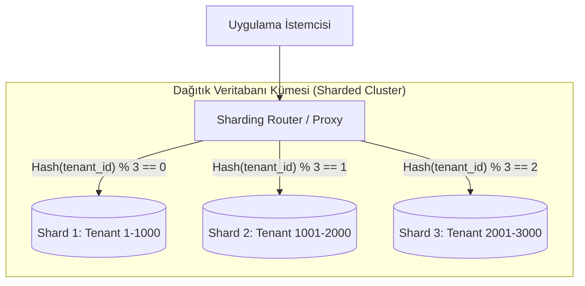

<!-- section:definition -->
## Tanım ve Çözdüğü Problem

Veritabanı Bölümleme (Database Sharding); devasa boyuttaki veri tablolarını ve yüksek okuma/yazma trafiğini tek bir veritabanı sunucusunun sınırlarını aşan durumlarda, verileri **Shard Key (Bölümleme Anahtarı)** adı verilen bir alana göre parçalayıp birden fazla bağımsız veritabanı düğümüne (Shard) yatay olarak dağıtma mimarisidir.

Dikey ölçekleme (daha fazla RAM/CPU ekleme) donanım ve maliyet sınırlarına ulaştığında Sharding, veri depolama ve sorgu yükünü küme genelinde yatayda ölçekleme imkanı sağlar.

<!-- section:components -->
## Temel Bileşenler

- **Shard Key:** Verinin hangi sharda yazılacağını ve sorgulanacağını belirleyen benzersiz alan (ör. `tenant_id`, `user_id`).
- **Sharding Router / Proxy:** İstemci sorgularını Shard Key değerine göre doğru veritabanı düğümüne yönlendiren bileşen (ör. Vitess, Citus, mongos).
- **Shard Nodes:** Verinin belirli bir bölümünü saklayan bağımsız ilişkisel veya NoSQL veritabanı örnekleri.
- **Global Metadata Catalog:** Shard aralıklarını ve haritalama kurallarını tutan merkezi katalog.

<!-- section:data-flow -->
## Veri ve Kontrol Akışı (Mermaid Şeması)

<!-- section:use-cases -->
## Kullanım Alanları ve Değiş-Tokuşlar

### Ideal Kullanım Alanları
- **Çok Kiracılı (Multi-tenant) SaaS Sistemleri:** Her kiracının verilerinin `tenant_id` bazında farklı shardtarda saklandığı uygulamalar.
- **Yüksek Hacimli E-Ticaret ve Sosyal Medya:** Tek sunucunun I/O kapasitesini aşan milyarlarca kayıt içeren veri depoları.

<!-- section:trade-offs -->
### Değiş-Tokuşlar (Trade-offs)
- **Çapraz Shard Sorgu Maliyeti (Cross-Shard Joins):** Shard Key içermeyen sorgular tüm shardlara yayınlanır (Scatter-Gather) ve yüksek gecikmeye yol açar.
- **Yeniden Dengelenme Karmaşıklığı (Resharding):** Yeni shard eklendiğinde verinin tutarlı özetleme (Consistent Hashing) ile taşınması zordur.

<!-- section:production -->
## Üretim ve Operasyon Zorlukları

1. **Shard Key Seçimi:** Yanlış anahtar seçimi hotspot (bir sharda aşırı yük binmesi) sorununa yol açar.
2. **Dağıtık İkincil İndeksler:** İkincil alanlara göre arama yapmak için küresel indeks tabloları tutulmalıdır.

<!-- section:security -->
## Güvenlik Kaygıları

- Kiracılar arası veri sızıntısını (Cross-Tenant Data Leakage) önlemek için Router seviyesinde katı yetkilendirme uygulanmalıdır.

<!-- section:testing -->
## Test ve Doğrulama

- Shard düğümlerinden biri çöktüğünde diğer shardların bağımsız çalışmaya devam ettiği (Fault Isolation) doğrulanmalıdır.

<!-- section:observability -->
## Gözlemlenebilirlik

- Shardlar arasındaki veri boyutu dengesizliği (Data Skew) ve sorgu dağılımı Prometheus panellerinde izlenmelidir.

<!-- section:alternatives -->
## Alternatifler

- **Read Replicas:** Yalnızca okuma yükünün yüksek olduğu sistemlerde sharding yapmadan okuma kopyaları ekleme.
- **Distributed SQL (NewSQL):** CockroachDB veya TiDB gibi sharding yönetimini veritabanı motoru içinde otomatik halleden sistemler.

<!-- section:sources -->
## Kaynaklar

- PostgreSQL Official Documentation — Table Partitioning & Sharding
- MongoDB Manual — Sharded Cluster Architecture
