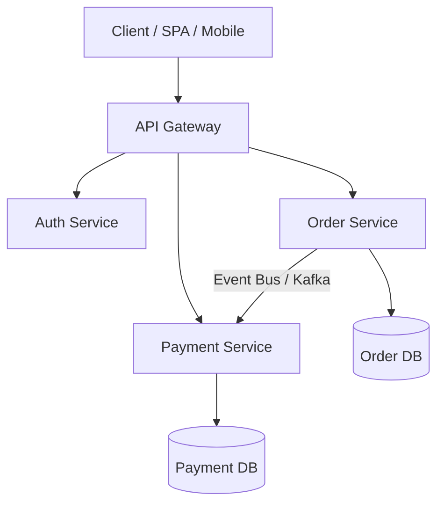

<!-- section:definition -->
## Definition and Problem Statement

Microservices Architecture is an architectural style that structures an application as a suite of small, autonomous services modeled around business domains. Each service runs in its own process and communicates via lightweight mechanisms (HTTP/REST, gRPC).

In large monolithic applications, codebases become tightly coupled, team communication overhead increases, and single points of failure risk entire system downtime. Microservices solve these problems by enforcing strong Bounded Context boundaries.

<!-- section:components -->
## Core Components

- **API Gateway:** The single entry point handling client requests, routing, authentication, and rate limiting.
- **Microservices (Domain Services):** Autonomous services with dedicated databases (Database-per-Service) and encapsulated domain logic.
- **Service Registry & Discovery:** Dynamic registry maintaining service instances and network locations (e.g., Consul, Eureka).
- **Centralized Telemetry:** Distributed tracing (OpenTelemetry), log aggregation, and metric dashboards.

<!-- section:data-flow -->
## Data & Control Flow (Mermaid Flowchart)

<!-- section:use-cases -->
## Use Cases and Trade-offs

### Primary Use Cases
- **Multi-Team Organizations:** Large engineering organizations aligned with Conway's Law where independent teams own domain boundaries.
- **Heterogeneous Scaling Requirements:** Systems where specific sub-domains require massive horizontal scale relative to others.

<!-- section:trade-offs -->
### Architectural Trade-offs
- **Distributed Complexity:** Network latency, partial failure modes, and eventual consistency management.
- **Operational Overhead:** Requirement for automated CI/CD pipelines, container orchestration, and telemetry infrastructure.

<!-- section:production -->
## Production & Operational Considerations

1. **Database-per-Service Enforcement:** Cross-database queries are forbidden; integration must occur strictly via APIs or messaging.
2. **Resilience Patterns:** Implement Circuit Breakers, Timeouts, and Retries for all inter-service communications.

<!-- section:security -->
## Security Concerns

- Enforce Mutual TLS (mTLS) for service-to-service communication and propagate user security context via JWT tokens.

<!-- section:testing -->
## Testing and Validation

- Implement Consumer-Driven Contract Testing (Pact) to prevent breaking API changes across service boundaries.

<!-- section:observability -->
## Observability

- Propagate a global `Trace ID` across all service boundaries and inspect distributed traces in Jaeger or Zipkin.

<!-- section:alternatives -->
## Alternatives

- **Modular Monolith:** Lower operational complexity alternative for smaller teams and early-stage systems.

<!-- section:sources -->
## Sources

- Martin Fowler, James Lewis — *Microservices: a definition of this new architectural term*
- IEEE SWEBOK v4.0 — Software Architecture Area
