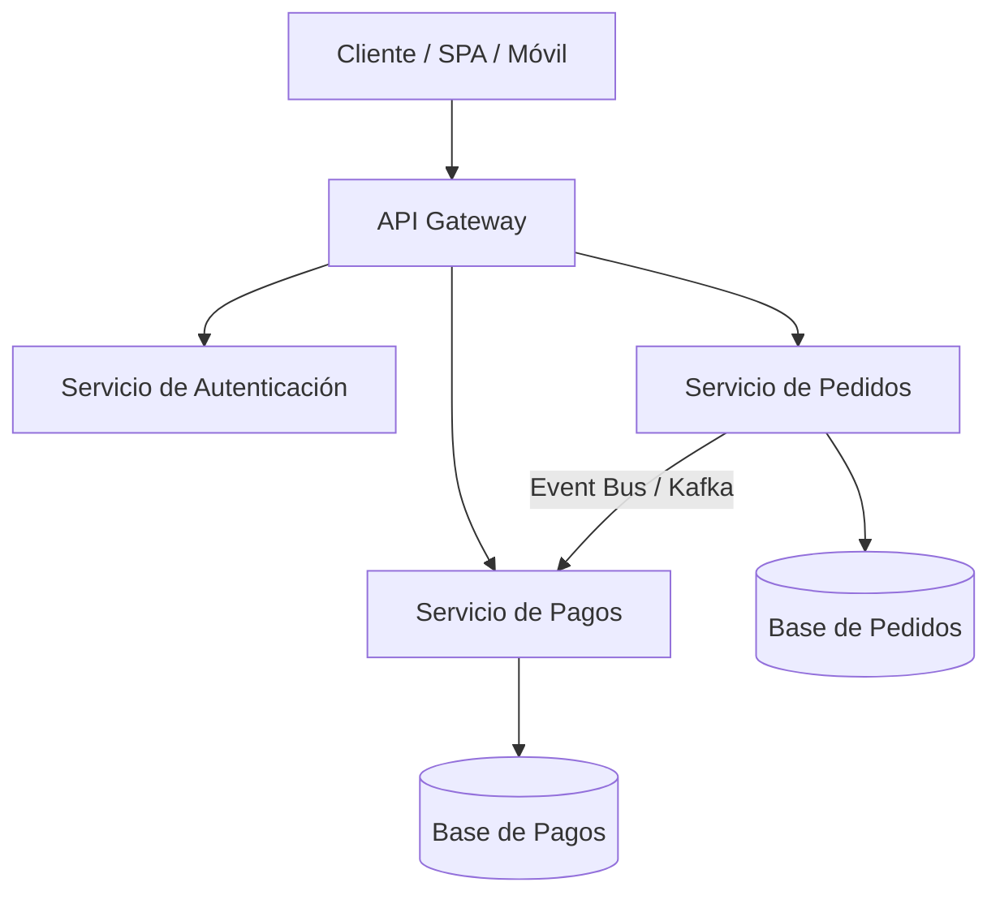

<!-- section:definition -->
## Definición y Descripción del Problema

La Arquitectura de Microservicios es un estilo arquitectónico que estructura una aplicación como un conjunto de servicios pequeños y autónomos diseñados en torno a dominios de negocio. Cada servicio se ejecuta en su propio proceso y se comunica mediante mecanismos ligeros (HTTP/REST, gRPC).

En aplicaciones monolíticas grandes, el código se acopla, la comunicación entre equipos se ralentiza y un fallo único puede tumbar todo el sistema. Los microservicios resuelven estos problemas mediante límites estrictos de contexto (Bounded Contexts).

<!-- section:components -->
## Componentes Principales

- **API Gateway:** Punto único de entrada que gestiona solicitudes, enrutamiento, autenticación y límite de tasa.
- **Microservicios (Domain Services):** Servicios autónomos con bases de datos independientes (Database-per-Service) y lógica encapsulada.
- **Registro y Descubrimiento de Servicios:** Registro dinámico que mantiene ubicaciones de red de los servicios (ej. Consul, Eureka).
- **Telemetría Centralizada:** Trazabilidad distribuida (OpenTelemetry), agregación de logs y paneles de métricas.

<!-- section:data-flow -->
## Flujo de Datos y Control (Diagrama Mermaid)

<!-- section:use-cases -->
## Casos de Uso y Compromisos

### Casos de Uso Principales
- **Organizaciones de Múltiples Equipos:** Estructuras alineadas con la Ley de Conway donde equipos independientes gestionan dominios distintos.
- **Escalabilidad Heterogénea:** Sistemas donde submódulos específicos requieren un escalado masivo en comparación con otros.

<!-- section:trade-offs -->
### Compromisos (Trade-offs)
- **Complejidad Distribuida:** Latencia de red, fallos parciales y gestión de consistencia eventual.
- **Sobrecarga Operativa:** Requiere automatización CI/CD, orquestación de contenedores e infraestructura de telemetría.

<!-- section:production -->
## Desafíos Operativos y de Producción

1. **Aislamiento de Base de Datos:** Las consultas directas entre bases de datos de diferentes servicios están prohibidas; la integración debe ser mediante API o mensajería.
2. **Patrones de Resiliencia:** Implementar Circuit Breakers y reintentos para comunicaciones entre servicios.

<!-- section:security -->
## Consideraciones de Seguridad

- Aplicar mTLS (TLS Mutuo) para comunicación entre servicios y propagación de contexto mediante tokens JWT.

<!-- section:testing -->
## Pruebas y Validación

- Implementar Pruebas de Contrato (Pact) para evitar cambios disruptivos en las API entre servicios.

<!-- section:observability -->
## Observabilidad

- Propagar un `Trace ID` global a través de todos los servicios e inspeccionar trazas distribuidas.

<!-- section:alternatives -->
## Alternativas

- **Monolito Modular:** Alternativa de menor complejidad operativa para equipos pequeños y etapas iniciales.

<!-- section:sources -->
## Fuentes

- Martin Fowler, James Lewis — *Microservices: a definition of this new architectural term*
- IEEE SWEBOK v4.0 — Software Architecture Area
