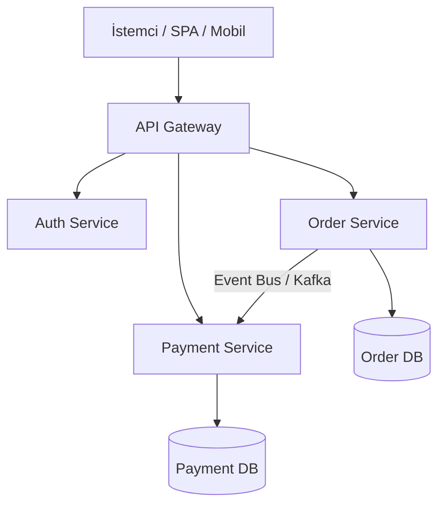

<!-- section:definition -->
## Tanım ve Çözdüğü Problem

Mikroservis Mimarisi (Microservices Architecture); tek parçalı (monolitik) bir yazılım uygulamasını, kendi süreçlerinde (process) çalışan, hafif (lightweight) protokoller (HTTP/REST, gRPC) üzerinden haberleşen, bağımsız olarak sürümlenen ve dağıtılan iş odaklı servisler kümesine bölen mimari stildir.

Büyük monolit sistemlerde kod tabanının büyümesi ekipler arası bağımlılıkları artırır, tek bir bileşendeki hatanın tüm sistemi çökertmesine neden olur ve bağımsız ölçeklemeyi engeller. Mikroservisler bu sorunları modülerlik ve alan odaklı sınırlar (Bounded Contexts) ile çözer.

<!-- section:components -->
## Temel Bileşenler

- **API Gateway:** Dış istemci isteklerini karşılayan, yönlendirme, kimlik doğrulama ve oran sınırlama (rate limiting) yapan tek giriş noktası.
- **Microservices (Domain Services):** Kendi veritabanına (Database-per-Service) ve iş kurallarına sahip bağımsız servisler.
- **Service Registry & Discovery:** Dinamik IP ve port adreslerini kaydeden ve servislerin birbirini bulmasını sağlayan mekanizma (ör. Consul, Eureka).
- **Centralized Telemetry:** Dağıtık izleme (Distributed Tracing / OpenTelemetry), log toplama ve metrik panelleri.

<!-- section:data-flow -->
## Veri ve Kontrol Akışı (Mermaid Akış Diyagramı)

<!-- section:use-cases -->
## Kullanım Alanları ve Değiş-Tokuşlar

### Ideal Kullanım Alanları
- **Çok Ekipli Büyük Organizasyonlar:** Conway Yasası uyarınca farklı ekiplerin bağımsız ürün modülleri geliştirdiği yapılar.
- **Heterojen Ölçekleme İhtiyacı:** Ödeme modülünün 100 sunucu, raporlama modülünün 2 sunucu gerektirdiği sistemler.

<!-- section:trade-offs -->
### Değiş-Tokuşlar (Trade-offs)
- **Dağıtık Karmaşıklık:** Ağ gecikmesi (network latency), kısmi arızalar (partial failures) ve veri tutarsızlığı yönetimi.
- **Operasyonel Yük:** CI/CD süreçleri, konteyner orkestrasyonu ve izleme maliyeti.

<!-- section:production -->
## Üretim ve Operasyon Zorlukları

1. **Database-per-Service:** Servislerin birbirlerinin veritabanına doğrudan erişmesi kesinlikle engellenmeli, veri paylaşımı API veya Event Bus üzerinden yapılmalıdır.
2. **Kısmi Arıza Yönetimi:** Devre Kesici (Circuit Breaker) ve Retry politikaları uygulanmalıdır.

<!-- section:security -->
## Güvenlik Kaygıları

- Servisler arası mTLS (Mutual TLS) iletişimi ve JWT tabanlı kimlik/yetki aktarımı (token propagation) zorunlu kılınmalıdır.

<!-- section:testing -->
## Test ve Doğrulama

- Servis sınırlarının bozulmadığını garanti etmek için Sözleşme Testleri (Consumer-Driven Contract Testing / Pact) uygulanmalıdır.

<!-- section:observability -->
## Gözlemlenebilirlik

- Her isteğe benzersiz bir `Trace ID` ve `Correlation ID` atanmalı, OpenTelemetry ile dağıtık izleme yapılmalıdır.

<!-- section:alternatives -->
## Alternatifler

- **Modüler Monolit:** Küçük ekipler ve ilk aşama girişimler için daha düşük operasyonel karmaşıklığa sahip güçlü alternatif.

<!-- section:sources -->
## Kaynaklar

- Martin Fowler, James Lewis — *Microservices: a definition of this new architectural term*
- IEEE SWEBOK v4.0 — Software Architecture Area
