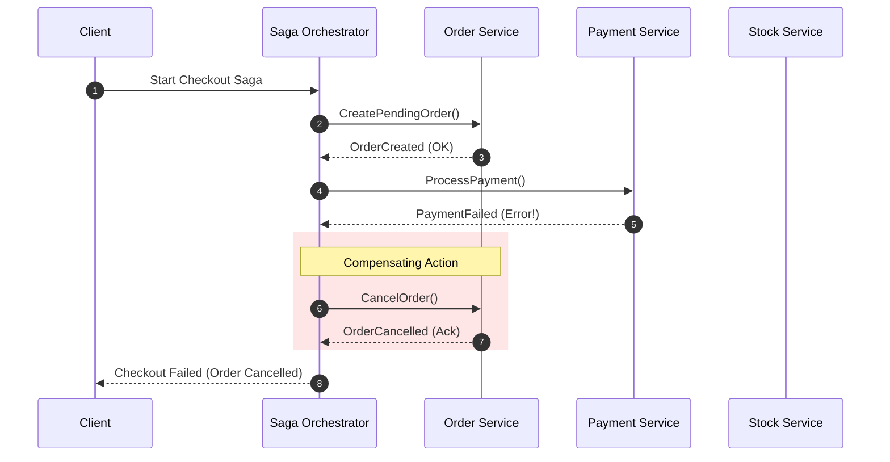

<!-- section:definition -->
## Definition and Problem Statement

The Saga Pattern is a distributed architectural pattern designed to maintain data consistency across multiple microservices without distributed ACID locks.

Traditional Two-Phase Commit (2PC) protocols lock database resources and introduce significant latency in microservice architectures. Sagas replace 2PC by executing a sequence of local transactions where each service commits its own state locally, triggering **Compensating Transactions** if a downstream step fails.

<!-- section:components -->
## Core Components

- **Choreography Saga:** Decentralized model where services listen to domain events and execute local actions independently.
- **Orchestration Saga:** Centralized model where a **Saga Orchestrator** manages step execution and failure recovery via a state machine.
- **Compensating Transactions:** Explicit undo actions reversing the business impact of previously committed steps upon failure.

<!-- section:data-flow -->
## Data & Control Flow (Orchestration Saga Mermaid Diagram)

<!-- section:use-cases -->
## Use Cases and Trade-offs

### Primary Use Cases
- **Multi-Step Business Workflows:** E-commerce checkout flows involving Order, Payment, Inventory, and Shipping services.
- **Distributed Financial Transfers:** Cross-service fund movements requiring auditability and rollback mechanisms.

<!-- section:trade-offs -->
### Architectural Trade-offs
- **Eventual Consistency:** System state is temporarily inconsistent until the Saga fully completes or rolls back.
- **Lack of Isolation (ACID 'I'):** Intermediate committed states are visible to concurrent queries (dirty reads).

<!-- section:production -->
## Production & Operational Considerations

1. **Handling Isolation Anomalies:** Use semantic locks (e.g., `PENDING` states) to prevent concurrent modification anomalies.
2. **Orchestrator State Persistence:** Saga state machine transitions must be durably stored to survive crashes.

<!-- section:security -->
## Security Concerns

- Validate compensation triggers to prevent unauthorized or forged rollback execution requests.

<!-- section:testing -->
## Testing and Validation

- Conduct Fault Injection testing at each step to verify that compensation flows execute reliably.

<!-- section:observability -->
## Observability

- Assign a correlation `Saga Execution ID` across all participating microservices for distributed tracing.

<!-- section:alternatives -->
## Alternatives

- **2PC / XA Transactions:** Limited to single relational database clusters or low-scale enterprise systems.

<!-- section:sources -->
## Sources

- Hector Garcia-Molina, Kenneth Salem — *Sagas (ACM SIGMOD 1987)*
- IEEE SWEBOK v4.0 — Software Architecture & Distributed Systems
