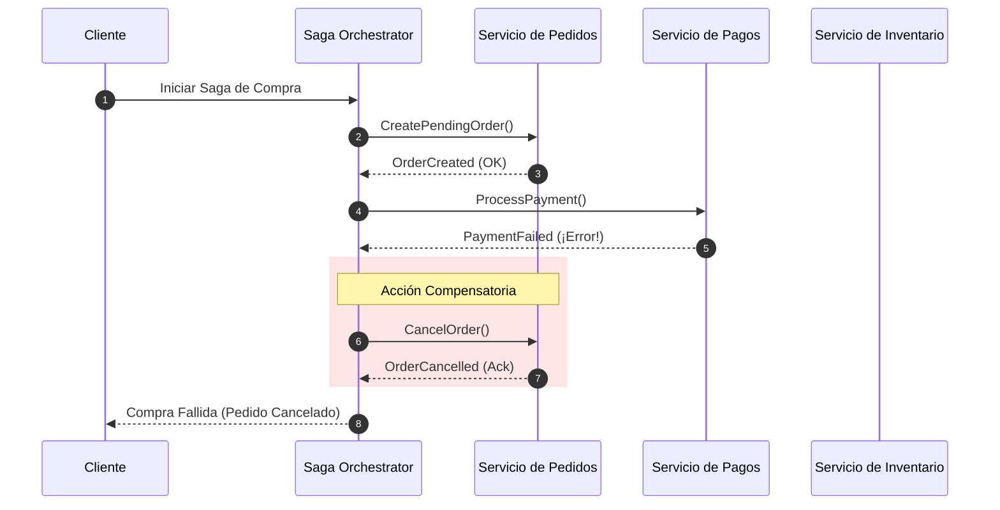

<!-- section:definition -->
## Definición y Descripción del Problema

El Patrón Saga es un patrón de arquitectura distribuida diseñado para mantener la consistencia de datos a través de múltiples microservicios sin utilizar bloqueos ACID distribuidos.

Los protocolos tradicionales de compromiso en dos fases (2PC) bloquean recursos de base de datos e introducen latencia. Las Sagas reemplazan a 2PC ejecutando transacciones locales donde cada servicio confirma su estado localmente y activa **Transacciones Compensatorias** en caso de fallo posterior.

<!-- section:components -->
## Componentes Principales

- **Choreography Saga:** Modelo descentralizado donde los servicios escuchan eventos de dominio y ejecutan acciones locales.
- **Orchestration Saga:** Modelo centralizado donde un **Orquestador Saga** gestiona la ejecución y recuperación mediante una máquina de estados.
- **Transacciones Compensatorias:** Acciones explícitas de deshacer que revierten el impacto de pasos previamente confirmados.

<!-- section:data-flow -->
## Flujo de Datos y Control (Diagrama Mermaid)

<!-- section:use-cases -->
## Casos de Uso y Compromisos

### Casos de Uso Principales
- **Flujos de Trabajo de Múltiples Pasos:** Procesos de compra en comercio electrónico (Pedidos, Pagos, Inventario, Envíos).
- **Transferencias Financieras Distribuidas:** Movimientos de fondos entre microservicios que requieren trazabilidad y reversión.

<!-- section:trade-offs -->
### Compromisos (Trade-offs)
- **Consistencia Eventual:** El estado del sistema es temporalmente inconsistente hasta que la Saga finaliza o se revierte.
- **Falta de Aislamiento (ACID 'I'):** Los estados intermedios confirmados son visibles para consultas concurrentes.

<!-- section:production -->
## Desafíos Operativos y de Producción

1. **Gestión de Anomalías de Aislamiento:** Utilizar bloqueos semánticos (ej. estado `PENDING`) para evitar conflictos concurrentes.
2. **Persistencia del Orquestador:** Las transiciones de la máquina de estados deben almacenarse de forma duradera.

<!-- section:security -->
## Consideraciones de Seguridad

- Validar las solicitudes de compensación para evitar ejecuciones no autorizadas o forjadas.

<!-- section:testing -->
## Pruebas y Validación

- Realizar pruebas de inyección de fallos (Fault Injection) en cada paso para verificar las flujos compensatorios.

<!-- section:observability -->
## Observabilidad

- Asignar un `Saga Execution ID` global entre microservicios para trazabilidad distribuida.

<!-- section:alternatives -->
## Alternativas

- **Transacciones 2PC / XA:** Limitadas a bases de datos relacionales únicas y sistemas de menor escala.

<!-- section:sources -->
## Fuentes

- Hector Garcia-Molina, Kenneth Salem — *Sagas (ACM SIGMOD 1987)*
- IEEE SWEBOK v4.0 — Software Architecture & Distributed Systems
