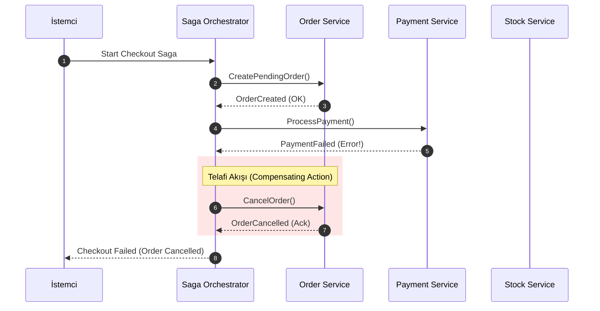

<!-- section:definition -->
## Tanım ve Çözdüğü Problem

Saga Kalıbı (Saga Pattern); birden fazla mikroservis ve veritabanına yayılan dağıtık işlemlerde (distributed transactions) veri tutarlılığını sağlamak için tasarlanmış mimari desendir. 

Geleneksel iki aşamalı taahhüt (Two-Phase Commit / 2PC) protokolleri mikroservis mimarilerinde kaynakları kilitler (locking) ve performansı ciddi şekilde düşürür. Saga kalıbı, 2PC yerine her servisin kendi yerel işlemini (local transaction) çalıştırdığı ve hata durumunda geriye dönük **Telafi Edici İşlemleri (Compensating Transactions)** tetiklediği asenkron bir mekanizma sunar.

<!-- section:components -->
## Temel Bileşenler

- **Choreography Saga:** Merkezi bir denetleyici olmadan, servislerin olay yayınlayarak (event-driven) birbirini sıralı tetiklediği merkeziyetsiz model.
- **Orchestration Saga:** Merkezi bir **Saga Orchestrator** servisinin işlem adımlarını ve hata telafi akışlarını durum makinesi (state machine) ile yönettiği model.
- **Compensating Transactions:** Bir adım başarısız olduğunda önceden tamamlanmış adımların etkisini geri alan (semantik rollback) işlemler.

<!-- section:data-flow -->
## Veri ve Kontrol Akışı (Orchestration Saga Mermaid Akışı)

<!-- section:use-cases -->
## Kullanım Alanları ve Değiş-Tokuşlar

### Ideal Kullanım Alanları
- **Çok Adımlı İş Süreçleri:** Sipariş alma -> Ödeme tahsilatı -> Stok düşme -> Kargo oluşturma gibi e-ticaret akışları.
- **Dağıtık Bankacılık ve Transferler:** Farklı mikroservisler arası para transferi ve bakiye güncelleme.

<!-- section:trade-offs -->
### Değiş-Tokuşlar (Trade-offs)
- **Nihai Tutarlılık (Eventual Consistency):** İşlem tamamlanana kadar sistem durumu geçici olarak tutarsız görünebilir.
- **İzolasyon Eksikliği (ACID 'I' Mimarisi):** Yerel işlemler hemen taahhüt (commit) edildiği için diğer işlemler geçici durumu okuyabilir (dirty reads).

<!-- section:production -->
## Üretim ve Operasyon Zorlukları

1. **İzolasyon Sorunlarını Çözme:** Semantic lock (ör. PENDING durumu) kullanarak eşzamanlı değişikliklerin önüne geçilmelidir.
2. **Durum Makinesi Kalıcılığı:** Orchestrator kendi durumunu (Saga State) veritabanına kesintisiz kaydetmelidir.

<!-- section:security -->
## Güvenlik Kaygıları

- Telafi edici işlemler yetkisiz tetiklemelere karşı doğrulanmalı, sahte (forged) telafi istekleri engellenmelidir.

<!-- section:testing -->
## Test ve Doğrulama

- Her bir adımda kasıtlı arıza (Fault Injection) üreterek telafi akışlarının eksiksiz çalıştığı doğrulanmalıdır.

<!-- section:observability -->
## Gözlemlenebilirlik

- Saga Execution ID ile tüm servisler genelinde sürecin hangi adımda takıldığı izlenebilmelidir.

<!-- section:alternatives -->
## Alternatifler

- **2PC / XA Transactions:** Yalnızca tekil ilişkisel veritabanı kümelerinde ve düşük ölçekli sistemlerde.

<!-- section:sources -->
## Kaynaklar

- Hector Garcia-Molina, Kenneth Salem — *Sagas (ACM SIGMOD 1987)*
- IEEE SWEBOK v4.0 — Software Architecture & Distributed Systems
