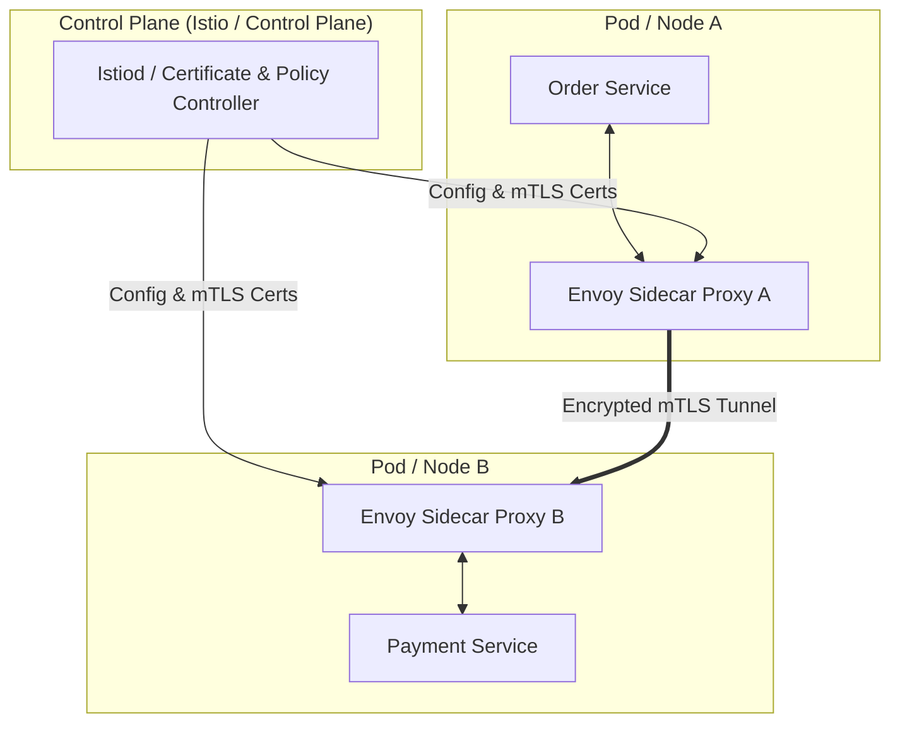

<!-- section:definition -->
## Definition and Problem Statement

A Service Mesh is a dedicated infrastructure layer that handles service-to-service (east-west) communication, traffic management, security, and observability across microservices without modifying application code.

As microservice architectures scale, embedding mTLS encryption, circuit breaking, retry policies, and distributed tracing into individual application codebases creates duplication and version fragmentation. A Service Mesh transparently delegates these tasks to proxies.

<!-- section:components -->
## Core Components

- **Data Plane:** Network of lightweight **Sidecar Proxies** (e.g., Envoy) deployed alongside application containers intercepting all inbound and outbound traffic.
- **Control Plane:** Centralized management component (e.g., Istiod) configuring proxies, distributing mTLS certificates, and enforcing routing policies.
- **Ingress / Egress Gateways:** Edge proxies managing external incoming and outgoing cluster traffic.

<!-- section:data-flow -->
## Data & Control Flow (Mermaid Flowchart)

<!-- section:use-cases -->
## Use Cases and Trade-offs

### Primary Use Cases
- **Zero Trust Security Architectures:** Mandating strict mTLS encryption and identity verification across all internal microservice calls.
- **Advanced Traffic Engineering:** Performing Canary deployments, Blue-Green rollouts, and fault injection dynamically at the infrastructure layer.

<!-- section:trade-offs -->
### Architectural Trade-offs
- **Added Latency:** Intercepting network packets via two sidecar proxies adds millisecond-level overhead per call.
- **Resource Footprint:** Running dedicated sidecar containers consumes additional CPU and memory per pod.

<!-- section:production -->
## Production & Operational Considerations

1. **Ambient / Sidecarless Mesh:** Consider eBPF-based node-level proxying to eliminate per-pod sidecar resource overhead.
2. **Automated Certificate Rotation:** Ensure SPIFFE/SPIRE automatic mTLS certificate renewal works without service interruption.

<!-- section:security -->
## Security Concerns

- Enforce strict mTLS mode and SPIFFE-based identity authorization rules, blocking unencrypted plaintext connections.

<!-- section:testing -->
## Testing and Validation

- Conduct Chaos Engineering tests (e.g., Chaos Mesh) to inject artificial network delay or packet loss at the proxy layer.

<!-- section:observability -->
## Observability

- Visualize live topology maps and mTLS encryption statuses using Kiali and Jaeger tracing integrations.

<!-- section:alternatives -->
## Alternatives

- **Application-Level Libraries (Netflix Ribbon/Hystrix):** Legacy approach requiring polyglot SDK maintenance for every programming language.

<!-- section:sources -->
## Sources

- Istio Service Mesh Official Documentation
- Envoy Proxy Architecture Specification
