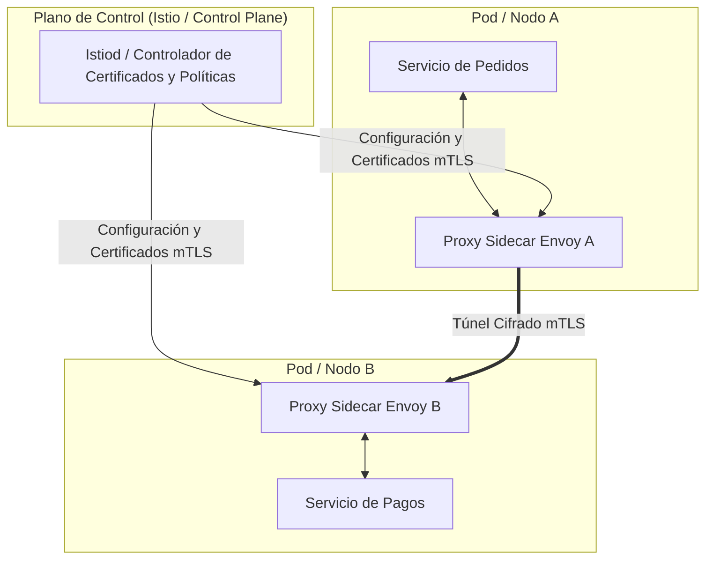

<!-- section:definition -->
## Definición y Descripción del Problema

Una Service Mesh (Malla de Servicios) es una capa de infraestructura dedicada que gestiona la comunicación entre servicios (este-oeste), el enrutamiento de tráfico, la seguridad y la observabilidad sin modificar el código de la aplicación.

A medida que las arquitecturas de microservicios crecen, incluir cifrado mTLS, políticas de reintento y trazabilidad en cada código genera duplicación y fragmentación. Una Service Mesh delega estas funciones a proxies de forma transparente.

<!-- section:components -->
## Componentes Principales

- **Plano de Datos (Data Plane):** Red de **Proxies Sidecar** (ej. Envoy) desplegados junto a los contenedores que interceptan todo el tráfico.
- **Plano de Control (Control Plane):** Componente de gestión centralizada (ej. Istiod) que configura los proxies y distribuye certificados mTLS.
- **Gateways Ingress / Egress:** Proxies perimetrales que gestionan el tráfico entrante y saliente del clúster.

<!-- section:data-flow -->
## Flujo de Datos y Control (Diagrama Mermaid)

<!-- section:use-cases -->
## Casos de Uso y Compromisos

### Casos de Uso Principales
- **Arquitecturas de Confianza Cero (Zero Trust):** Requerir cifrado mTLS estricto y verificación de identidad en todas las llamadas internas.
- **Ingeniería de Tráfico Avanzada:** Realizar despliegues Canary, Blue-Green e inyección de fallos de forma dinámica.

<!-- section:trade-offs -->
### Compromisos (Trade-offs)
- **Latencia Adicional:** La intercepción de paquetes mediante proxies sidecar añade un margen de milisegundos por llamada.
- **Consumo de Recursos:** Ejecutar contenedores sidecar dedicados consume CPU y memoria adicional en cada pod.

<!-- section:production -->
## Desafíos Operativos y de Producción

1. **Service Mesh sin Sidecar (Ambient):** Evaluar arquitecturas basadas en eBPF a nivel de nodo para eliminar la sobrecarga de sidecars por pod.
2. **Rotación Automática de Certificados:** Garantizar la renovación automática de certificados mTLS (SPIFFE/SPIRE) sin interrupción.

<!-- section:security -->
## Consideraciones de Seguridad

- Aplicar el modo mTLS estricto y reglas de autorización basadas en SPIFFE, bloqueando conexiones en texto plano.

<!-- section:testing -->
## Pruebas y Validación

- Realizar pruebas de Ingeniería de Caos (ej. Chaos Mesh) para inyectar latencia o pérdida de paquetes a nivel de proxy.

<!-- section:observability -->
## Observabilidad

- Visualizar mapas de topología en vivo y estados de cifrado mTLS mediante integraciones con Kiali y Jaeger.

<!-- section:alternatives -->
## Alternativas

- **Librerías a Nivel de Aplicación (Netflix Ribbon/Hystrix):** Enfoque heredado que requiere mantenimiento de SDKs para cada lenguaje.

<!-- section:sources -->
## Fuentes

- Istio Service Mesh Official Documentation
- Envoy Proxy Architecture Specification
