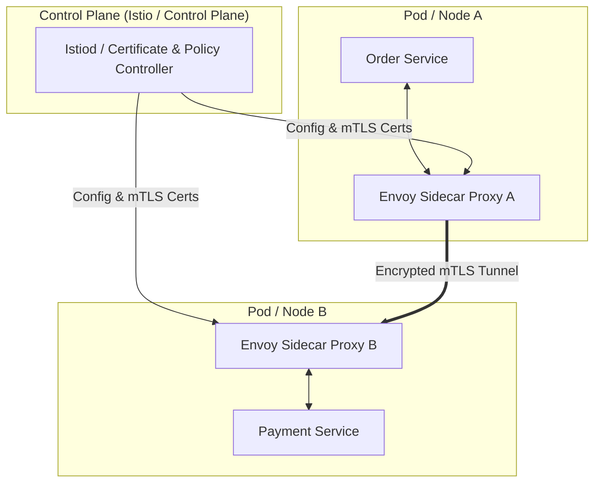

<!-- section:definition -->
## Tanım ve Çözdüğü Problem

Service Mesh (Servis Ağı); dağıtık mikroservis mimarilerinde servisler arası (east-west) iletişimi, trafik yönetimini, güvenliği ve gözlemlenebilirliği uygulama kodundan soyutlayarak altyapı katmanına taşıyan mimari desendir.

Mikroservis sayısı arttıkça mTLS şifreleme, yeniden deneme (retry), devre kesme (circuit breaking) ve izleme kodlarının her servise ayrı ayrı yazılması kod tekrarına ve versiyon karmaşasına yol açar. Service Mesh bu işlevleri şeffaf bir şekilde üstlenir.

<!-- section:components -->
## Temel Bileşenler

- **Data Plane (Veri Düzlemi):** Servis konteynerlerinin yanına **Sidecar Proxy** (ör. Envoy) olarak konuşlandırılan ve tüm giriş/çıkış ağ trafiğini karşılayan proxy katmanı.
- **Control Plane (Kontrol Düzlemi):** Sidecar proxy'lerin konfigürasyonunu, mTLS sertifika dağıtımını ve trafik politikalarını merkezi olarak yöneten bileşen (ör. Istiod).
- **Ingress / Egress Gateway:** Ağın dışından gelen veya dışına çıkan trafiği yöneten uç proxy'ler.

<!-- section:data-flow -->
## Veri ve Kontrol Akışı (Mermaid Şeması)

<!-- section:use-cases -->
## Kullanım Alanları ve Değiş-Tokuşlar

### Ideal Kullanım Alanları
- **Sıfır Güven (Zero Trust) Mimarileri:** Tüm servis içi iletişimin mTLS ile şifrelenmesi gereken kurumsal yapılar.
- **Gelişmiş Dağıtım Stratejileri:** Canary, Blue-Green ve A/B test trafik yönlendirmelerinin koda dokunmadan yapılması.

<!-- section:trade-offs -->
### Değiş-Tokuşlar (Trade-offs)
- **Ek Gecikme (Latency):** Her istek iki ek proxy (sidecar) üzerinden geçtiği için milisaniye düzeyinde ek gecikme oluşur.
- **Bellek ve CPU Tüketimi:** Her pod yanında bir proxy çalıştırmak toplam kaynak tüketimini artırır.

<!-- section:production -->
## Üretim ve Operasyon Zorlukları

1. **Ambient / Sidecarless Mesh:** Sidecar kaynak yükünü azaltmak için node düzeyinde çalışan eBPF tabanlı mimariler değerlendirilmelidir.
2. **Sertifika Rotasyonu:** mTLS sertifikalarının sorunsuz otomatik rotasyonu (SPIFFE/SPIRE) izlenmelidir.

<!-- section:security -->
## Güvenlik Kaygıları

- Servis kimlik doğrulaması (SPIFFE ID) ve strict mTLS politikası uygulanmalı, şifrelenmemiş trafiğe izin verilmemelidir.

<!-- section:testing -->
## Test ve Doğrulama

- Chaos Engineering araçları (ör. Chaos Mesh) ile proxy seviyesinde gecikme veya paket kaybı enjekte edilerek dayanıklılık test edilmelidir.

<!-- section:observability -->
## Gözlemlenebilirlik

- Kiali ve Jaeger entegrasyonu ile servis bağlantı grafiği ve mTLS durumu canlı izlenmelidir.

<!-- section:alternatives -->
## Alternatifler

- **İstemci Tarafı Kütüphaneler (Netflix Ribbon/Hystrix):** Her dil için ayrı SDK bakımı gerektiren eski yaklaşım.

<!-- section:sources -->
## Kaynaklar

- Istio Service Mesh Official Documentation
- Envoy Proxy Architecture Specification
