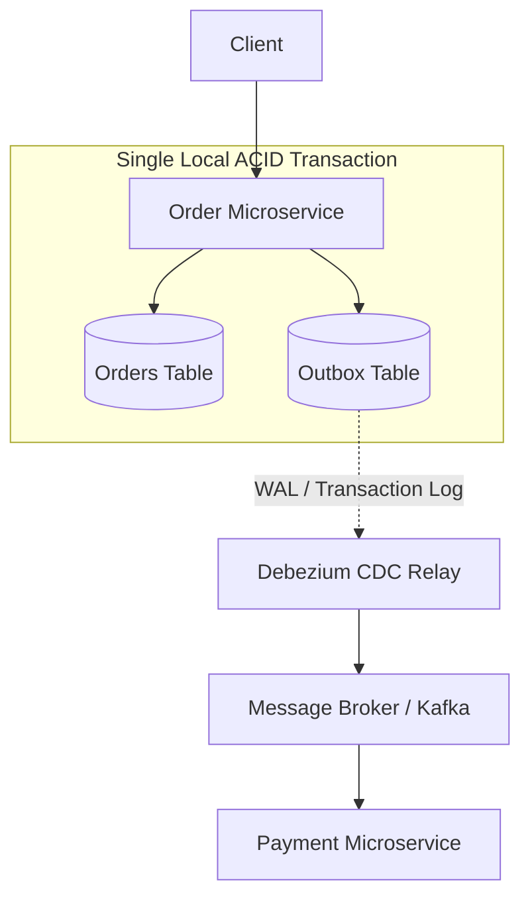

<!-- section:definition -->
## Definition and Problem Statement

The Transactional Outbox Pattern solves the **Dual-Write Problem** in microservices, which occurs when an application must update its local database and publish an event to a message broker (e.g., Kafka, RabbitMQ) as part of a single business operation.

If a service updates the database and crashes before sending the event—or if the network drops—the system becomes inconsistent. The Transactional Outbox pattern writes the event into an **Outbox Table** inside the exact same local ACID transaction as the business entity update.

<!-- section:components -->
## Core Components

- **Business Entity Table:** Primary domain database table (e.g., `orders`).
- **Outbox Table:** Append-only event queue table stored in the same relational database (e.g., `outbox`).
- **Message Relay / CDC Engine:** Asynchronous process reading new outbox rows via Transaction Log Tailing (WAL/Binlog) and publishing to the broker (e.g., Debezium).
- **Message Broker:** Central message queue delivering events to downstream consumers (e.g., Apache Kafka).

<!-- section:data-flow -->
## Data & Control Flow (Mermaid Flowchart)

<!-- section:use-cases -->
## Use Cases and Trade-offs

### Primary Use Cases
- **At-Least-Once Event Delivery:** Systems where event loss is intolerable (finance, order processing, inventory).
- **Saga and CQRS Infrastructures:** Event-driven architectures requiring 100% event publishing guarantees.

<!-- section:trade-offs -->
### Architectural Trade-offs
- **Additional Storage Overhead:** Dual writes to business and outbox tables increase database write load.
- **Message Relay Operational Cost:** Running CDC engines (Debezium/Kafka Connect) introduces infrastructure management effort.

<!-- section:production -->
## Production & Operational Considerations

1. **Outbox Table Truncation:** Successfully published outbox entries must be routinely pruned or archived.
2. **Idempotent Consumers:** Because CDC relays guarantee at-least-once delivery, downstream consumers must process messages idempotently.

<!-- section:security -->
## Security Concerns

- Sensitive fields in the outbox table must be encrypted or masked before being written or streamed to message queues.

<!-- section:testing -->
## Testing and Validation

- Use integration tests to verify that database transaction rollbacks also prevent outbox event insertion.

<!-- section:observability -->
## Observability

- Track the unprocessed outbox record lag metric via Prometheus to alert on relay stalling.

<!-- section:alternatives -->
## Alternatives

- **Two-Phase Commit (2PC):** Unsuitable for high-throughput distributed microservices due to locking overhead.
- **Direct Event Publishing:** Acceptable only in non-critical telemetry or log aggregation scenarios.

<!-- section:sources -->
## Sources

- Debezium Outbox Event Router Specification
- IEEE SWEBOK v4.0 — Software Architecture Knowledge
