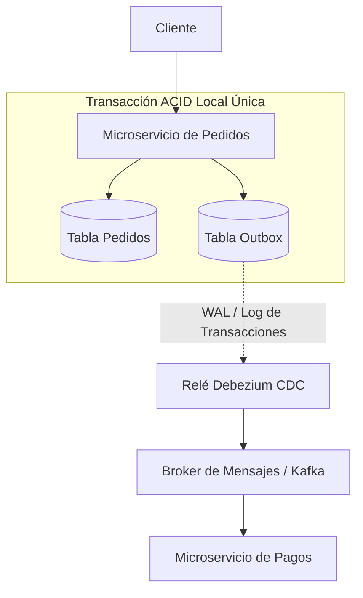

<!-- section:definition -->
## Definición y Descripción del Problema

El patrón Transactional Outbox resuelve el problema de la **Doble Escritura (Dual-Write)** en microservicios, que ocurre cuando una aplicación debe actualizar su base de datos local y publicar un evento en un gestor de mensajes (Kafka, RabbitMQ) en la misma operación.

Si la aplicación actualiza la base de datos y falla antes de publicar el evento, el sistema queda en un estado inconsistente. El patrón Transactional Outbox escribe el evento en una **Tabla Outbox** dentro de la misma transacción ACID local.

<!-- section:components -->
## Componentes Principales

- **Tabla de Entidad de Negocio:** Tabla principal del dominio (ej. `orders`).
- **Tabla Outbox:** Tabla de solo adición almacenada en la misma base de datos relacional (ej. `outbox`).
- **Relé de Mensajes / Motor CDC:** Proceso asíncrono que lee nuevos registros mediante lectura del registro de transacciones (WAL/Binlog) y los publica (ej. Debezium).
- **Broker de Mensajes:** Cola central que entrega eventos a los consumidores (ej. Apache Kafka).

<!-- section:data-flow -->
## Flujo de Datos y Control (Diagrama Mermaid)

<!-- section:use-cases -->
## Casos de Uso y Compromisos

### Casos de Uso Principales
- **Entrega de Eventos Garantizada (At-Least-Once):** Sistemas donde la pérdida de eventos es inaceptable (finanzas, pedidos).
- **Infraestructuras Saga y CQRS:** Arquitecturas dirigidas por eventos que requieren garantía del 100% en publicación.

<!-- section:trade-offs -->
### Compromisos (Trade-offs)
- **Sobrecarga de Almacenamiento:** Doble escritura en tablas de negocio y outbox.
- **Costo Operativo de Relé:** Mantener motores CDC (Debezium/Kafka Connect) añade complejidad de infraestructura.

<!-- section:production -->
## Desafíos Operativos y de Producción

1. **Purga de la Tabla Outbox:** Los registros publicados con éxito deben eliminarse o archivarse periódicamente.
2. **Consumidores Idempotentes:** Dado que los relés CDC garantizan al menos una entrega, los consumidores deben ser idempotentes.

<!-- section:security -->
## Consideraciones de Seguridad

- Los campos sensibles en la tabla outbox deben cifrarse o enmascararse antes de su envío a las colas de mensajes.

<!-- section:testing -->
## Pruebas y Validación

- Utilizar pruebas de integración para verificar que la cancelación de transacciones evite la inserción en la tabla outbox.

<!-- section:observability -->
## Observabilidad

- Monitorizar el retraso de registros no procesados en la tabla outbox mediante métricas Prometheus.

<!-- section:alternatives -->
## Alternativas

- **Compromiso en Dos Fases (2PC):** No recomendado para microservicios de alto rendimiento debido a bloqueos.
- **Publicación Directa:** Aceptable solo en escenarios de telemetría o logs donde la pérdida no sea crítica.

<!-- section:sources -->
## Fuentes

- Debezium Outbox Event Router Specification
- IEEE SWEBOK v4.0 — Software Architecture Knowledge
