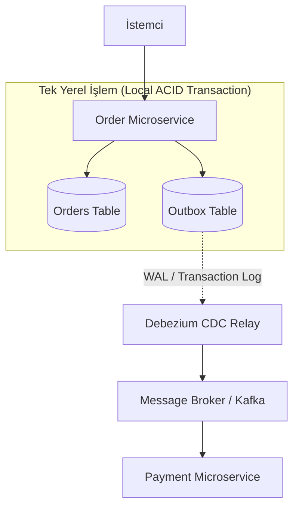

<!-- section:definition -->
## Tanım ve Çözdüğü Problem

Transactional Outbox Kalıbı; mikroservis mimarilerinde veritabanı güncellemesi yapıldıktan sonra mesaj kuyruğuna (Kafka, RabbitMQ) olay yayınlanması sırasında ortaya çıkan **Çift Yazma (Dual-Write)** problemini çözen mimari tasarımdır.

Bir uygulama veritabanına yazıp hemen ardından mesaj kuyruğuna olay gönderdiğinde; ağ hatası veya sunucu çökmesi durumunda veritabanı güncellenmiş ancak mesaj yayınlanamamış (ya da tam tersi) olabilir. Transactional Outbox kalıbı, yayınlanacak olayı veritabanında **Outbox Tablosu** adında özel bir tabloya iş verisiyle aynı yerel işlem (local ACID transaction) içinde yazar.

<!-- section:components -->
## Temel Bileşenler

- **Business Entity Table:** İş alanına ait ana veri tablosu (ör. `orders`).
- **Outbox Table:** Yayınlanacak olayların saklandığı salt-eklenir tablo (ör. `outbox`).
- **Message Relay / CDC Engine:** Outbox tablosundaki yeni satırları veritabanı işlem günlüğünden (WAL / Binlog) okuyan ve mesaj kuyruğuna aktaran bileşen (ör. Debezium, Polling Publisher).
- **Message Broker:** Olayların mikroservislere iletildiği kuyruk (ör. Apache Kafka).

<!-- section:data-flow -->
## Veri ve Kontrol Akışı (Mermaid Şeması)

<!-- section:use-cases -->
## Kullanım Alanları ve Değiş-Tokuşlar

### Ideal Kullanım Alanları
- **Güvenilir Olay Yayınlama (At-Least-Once Delivery):** Olayların kaybolmasının kabul edilemeyeceği finans, sipariş ve stok sistemleri.
- **Saga ve CQRS Altyapıları:** Dağıtık işlemlerde olay iletiminin %100 garantili olması gereken mimariler.

<!-- section:trade-offs -->
### Değiş-Tokuşlar (Trade-offs)
- **Ek Veritabanı Yükü:** Her iş işleminde outbox tablosuna yazma yükü oluşur.
- **Message Relay İşletim Maliyeti:** CDC (Debezium/Kafka Connect) veya polling işleyicilerinin yönetimi operasyonel dikkat gerektirir.

<!-- section:production -->
## Üretim ve Operasyon Zorlukları

1. **Outbox Cleanup (Temizlik):** Başarıyla yayınlanan outbox kayıtları otomatik silinmeli veya arşivlenmelidir.
2. **Idempotent Consumers:** CDC mekanizmaları en az bir kez teslimat (at-least-once delivery) garantisi sunduğundan tüketiciler idempotent olmalıdır.

<!-- section:security -->
## Güvenlik Kaygıları

- Outbox tablosundaki hassas veri alanları mesaj kuyruğuna girmeden önce şifrelenmeli veya maskelenmelidir.

<!-- section:testing -->
## Test ve Doğrulama

- Veritabanı işlem iptalinde (rollback) outbox tablosuna da yazılmadığı entegrasyon testleriyle doğrulanmalıdır.

<!-- section:observability -->
## Gözlemlenebilirlik

- Outbox tablosundaki işlenmemiş kayıt sayısı (Unprocessed Outbox Lag) Prometheus metrikleri ile izlenmelidir.

<!-- section:alternatives -->
## Alternatifler

- **2PC / XA Commit:** Yüksek performans ve esneklik gerektiren mikroservislerde tavsiye edilmez.
- **Direct Event Publishing:** Yalnızca veri kaybının önemsiz olduğu telemetry/log senaryolarında.

<!-- section:sources -->
## Kaynaklar

- Debezium Outbox Event Router Specification
- IEEE SWEBOK v4.0 — Software Architecture Knowledge
