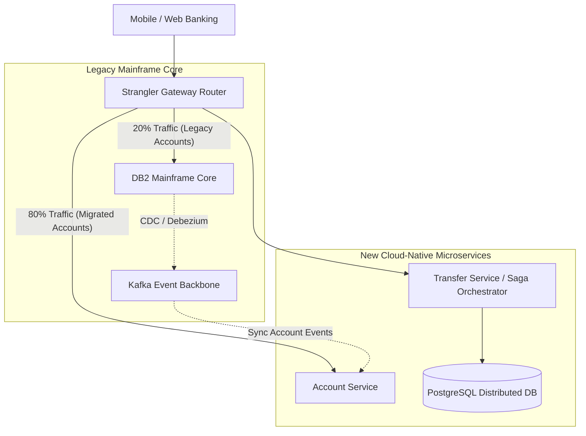

<!-- section:definition -->
## Executive Summary and Business Problem

The legacy **Core Banking Platform** ran on a COBOL/Mainframe architecture servicing 15 million accounts with a peak processing capacity of 8,000 TPS.

Faced with escalating mainframe licensing costs, batch processing delays, and multi-month feature release cycles, the engineering team executed a **Zero-Downtime Migration Architecture** to transition the legacy core into cloud-native event-driven microservices.

<!-- section:components -->
## Architectural Migration Strategy & Components

- **Strangler Fig Router:** Intelligent API Gateway incrementally routing incoming account and payment requests between mainframe and new microservices.
- **Transactional Outbox & CDC (Debezium):** Real-time Change Data Capture streaming DB2/Oracle mainframe updates to Apache Kafka topics.
- **Orchestrated Saga Engine:** Manages cross-account money transfers with eventual consistency, bypassing 2PC locking overhead.
- **Multi-Region Kubernetes Cluster:** Active-Active distributed cloud deployment.

<!-- section:data-flow -->
## Migration & Data Flow Diagram (Mermaid Flowchart)

<!-- section:use-cases -->
## Phased Implementation Roadmap

### Phased Migration Steps
1. **Phase 1 (Shadow Pipeline):** Real-time replication of mainframe events to PostgreSQL using Debezium CDC; live traffic was shadowed and verified.
2. **Phase 2 (Strangler Extraction):** New customer onboarding and account creation routed exclusively to new microservices.
3. **Phase 3 (Tenant Cut-Over):** Batch migration of existing account cohorts; complete mainframe decommissioning.

<!-- section:trade-offs -->
### Architectural Trade-offs
- **Dual-Infrastructure Overhead:** Running parallel mainframe and cloud environments during the 12-month transition increased operational budgets.
- **Reconciliation Complexity:** Maintaining real-time balance reconciliation across hybrid state boundaries.

<!-- section:production -->
## Production Results & Business Impact

1. **Zero Unplanned Downtime:** Maintained 100% service availability across the 18-month migration lifecycle.
2. **Latency Reduction:** Reduced p99 transaction processing latency from 850ms to 42ms.
3. **Cost Savings:** Achieved a 68% reduction in annual mainframe licensing and infrastructure maintenance costs.

<!-- section:security -->
## Security & Regulatory Compliance

- Complied with PCI-DSS 4.0 and banking regulations using mTLS encryption and Hardware Security Modules (HSM) for payload signing.

<!-- section:testing -->
## Testing and Validation

- Executed shadow testing over 100 million real-world production transactions to verify 100% data fidelity between platforms.

<!-- section:observability -->
## Observability

- Real-time end-to-end tracing monitored via OpenTelemetry, Grafana dashboards, and Jaeger.

<!-- section:alternatives -->
## Alternatives

- **Big-Bang Migration:** Single cut-over night (Rejected due to catastrophic risk exposure).

<!-- section:sources -->
## Sources

- Martin Fowler — *Microservices and Strangler Application Pattern*
- Debezium Architecture Specifications — Outbox & CDC Pattern
