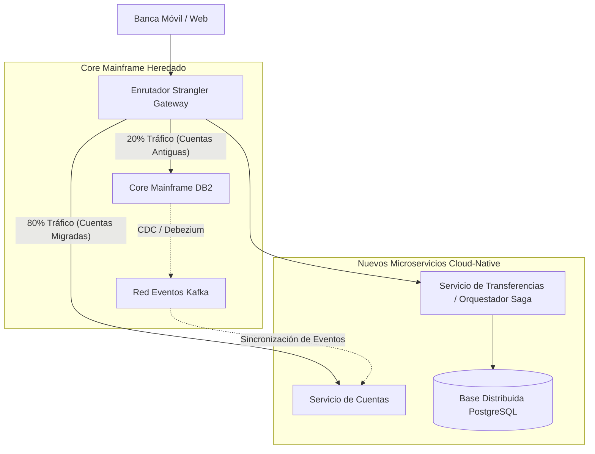

<!-- section:definition -->
## Resumen Ejecutivo y Problema de Negocio

La plataforma heredada de **Core Bancario** se ejecutaba en una arquitectura COBOL/Mainframe atendiendo a 15 millones de cuentas con una capacidad máxima de 8,000 TPS.

Ante el aumento de costos de licencias y retrasos en el procesamiento por lotes, el equipo ejecutó una **Arquitectura de Migración sin Tiempo de Inactividad** para transformar el núcleo heredado en microservicios dirigidos por eventos.

<!-- section:components -->
## Estrategia de Migración y Componentes

- **Enrutador Strangler Fig:** API Gateway inteligente que enrutaba solicitudes entre el mainframe y los nuevos microservicios.
- **Transactional Outbox y CDC (Debezium):** Captura de datos en tiempo real que transmitía actualizaciones de DB2 a temas de Apache Kafka.
- **Motor Orquestador Saga:** Gestionaba transferencias de dinero entre cuentas con consistencia eventual, evitando bloqueos 2PC.
- **Clúster Kubernetes Multirregión:** Despliegue en la nube en modo Activo-Activo.

<!-- section:data-flow -->
## Diagrama de Migración y Flujo de Datos (Diagrama Mermaid)

<!-- section:use-cases -->
## Hoja de Ruta de Implementación

### Fases de Migración
1. **Fase 1 (Shadow Pipeline):** Replicación en tiempo real de eventos del mainframe a PostgreSQL mediante Debezium CDC.
2. **Fase 2 (Extracción Strangler):** Creación de nuevas cuentas enrutada exclusivamente a los nuevos microservicios.
3. **Fase 3 (Conmutación):** Migración de cuentas existentes y desmantelamiento del mainframe.

<!-- section:trade-offs -->
### Compromisos (Trade-offs)
- **Sobrecarga de Doble Infraestructura:** Operar entornos paralelos durante 12 meses incrementó el presupuesto operativo.
- **Complejidad de Reconciliación:** Mantener la conciliación de saldos en tiempo real entre sistemas híbridos.

<!-- section:production -->
## Resultados de Producción e Impacto

1. **Cero Tiempo de Inactividad:** Se mantuvo una disponibilidad del 100% durante los 18 meses de migración.
2. **Reducción de Latencia:** La latencia p99 de procesamiento de transacciones se redujo de 850 ms a 42 ms.
3. **Ahorro de Costos:** Reducción del 68% en los costos anuales de licencias del mainframe.

<!-- section:security -->
## Seguridad y Cumplimiento Normativo

- Cumplimiento de PCI-DSS 4.0 mediante cifrado mTLS y módulos de seguridad de hardware (HSM).

<!-- section:testing -->
## Pruebas y Validación

- Se realizaron pruebas espejo con más de 100 millones de transacciones reales para verificar la fidelidad de datos al 100%.

<!-- section:observability -->
## Observabilidad

- Trazabilidad distribuida en tiempo real con OpenTelemetry, paneles Grafana y Jaeger.

<!-- section:alternatives -->
## Alternativas

- **Migración Gran Explosion (Big-Bang):** Transición en una sola noche (Rechazada por alto riesgo).

<!-- section:sources -->
## Fuentes

- Martin Fowler — *Microservices and Strangler Application Pattern*
- Debezium Architecture Specifications — Outbox & CDC Pattern
