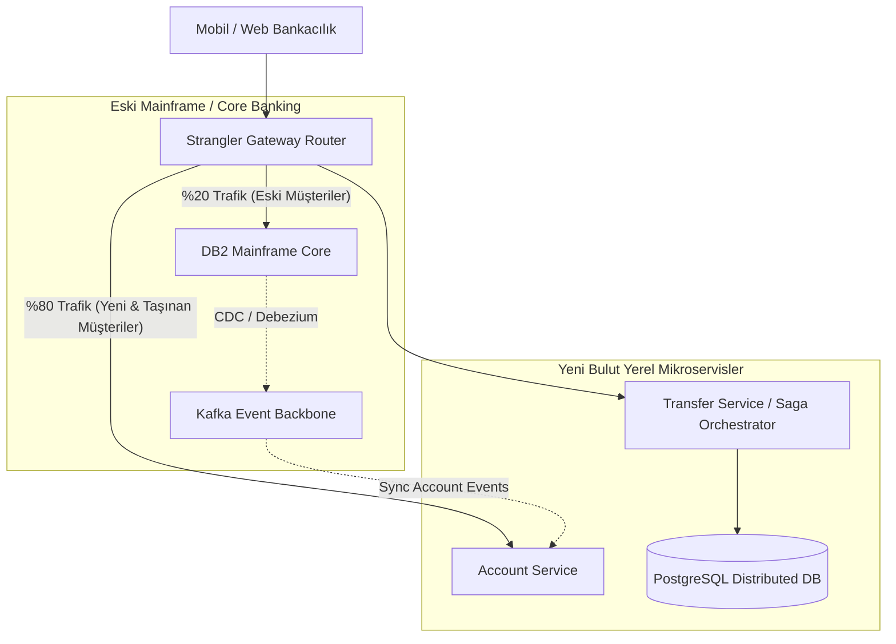

<!-- section:definition -->
## Vaka Özeti ve İş Problemi

Mevcut **Fintech Bankacılık Çekirdeği (Core Banking Platform)**, eski COBOL/Mainframe mimarisinde çalışan, günlük 15 milyon hesaba ve peak anlarda 8,000 TPS transfer trafiğine hizmet veren kritik bir sistemdir.

Eski sistemdeki yüksek lisans maliyetleri, batch işleme gecikmeleri ve yeni dijital ürünlerin canlıya alınmasındaki aylar süren gecikmeler nedeniyle sistemin **sıfır veri kaybı ve sıfır hizmet kesintisi (Zero-Downtime Migration)** ilkesiyle Bulut Yerel (Cloud-Native) mimariye dönüştürülmesi hedeflenmiştir.

<!-- section:components -->
## Mimari Dönüşüm Stratejisi ve Bileşenler

- **Strangler Fig Router:** Gelen hesap ve transfer isteklerini kademeli olarak eski sistem ile yeni mikroservisler arasında bölen akıllı API Gateway katmanı.
- **Transactional Outbox & CDC (Debezium):** Mainframe veritabanı değişikliklerini (DB2/Oracle) anlık yakalayıp Apache Kafka konularına yayınlayan Change Data Capture altyapısı.
- **Orchestrated Saga Engine:** Hesaplar arası para transferinde 2PC kullanmadan tutarlılık sağlayan Saga Orquestrator servisi.
- **Multi-Region Kubernetes Cluster:** Aktif-Aktif (Active-Active) modda çalışan mikroservis kümesi.

<!-- section:data-flow -->
## Dönüşüm ve Veri Akış Şeması (Mermaid Akışı)

<!-- section:use-cases -->
## Uygulanan Senaryolar ve Değiş-Tokuşlar

### Uygulama Aşamaları
1. **Faz 1 (Shadow Pipeline):** Tüm mainframe verileri CDC ile yeni PostgreSQL veritabanına aktarıldı, canlı trafik kopyalanarak paralel doğrulandı.
2. **Faz 2 (Strangler Migration):** Yeni müşteri hesapları doğrudan yeni mikroservisler üzerinde açıldı.
3. **Faz 3 (Cut-Over):** Eski müşteriler tenant bazlı canlı taşındı, mainframe devre dışı bırakıldı (decommissioned).

<!-- section:trade-offs -->
### Değiş-Tokuşlar (Trade-offs)
- **Geçici Çift Altyapı Maliyeti:** Geçiş sürecinde 12 ay boyunca hem mainframe hem de bulut altyapısının işletilmesinden kaynaklanan bütçe artışı.
- **Nihai Tutarlılık Karmaşıklığı:** Eski ve yeni sistemler aynı anda çalışırken bakiye eşleme (reconciliation) zorluğu.

<!-- section:production -->
## Üretim ve Operasyon Başarı Sonuçları

1. **Sıfır Kesinti:** 18 aylık dönüşüm boyunca kullanıcı tarafında 0 dakika plansız kesinti yaşandı.
2. **Performans Artışı:** p99 işlem gecikmesi 850ms'den 42ms seviyesine düşürüldü.
3. **Maliyet Tasarrufu:** Yıllık mainframe lisans ve bakım maliyetlerinde %68 tasarruf sağlandı.

<!-- section:security -->
## Güvenlik ve Uyum

- BDDK ve PCI-DSS 4.0 standartlarına uyumlu mTLS şifreleme ve HSM (Hardware Security Module) tabanlı veri imzalama sağlandı.

<!-- section:testing -->
## Test ve Doğrulama

- Paralel çalışma fazında 100 milyon gerçek işlem hem eski hem yeni sistemde çalıştırılıp tutarlılık %100 doğrulandı.

<!-- section:observability -->
## Gözlemlenebilirlik

- Prometheus, Grafana ve Jaeger ile tüm transfer akışları anlık takip edilmektedir.

<!-- section:alternatives -->
## Alternatifler

- **Big-Bang Migration:** Tek bir gecede tüm sistemi değiştirme (Yüksek risk nedeniyle reddedildi).

<!-- section:sources -->
## Kaynaklar

- Martin Fowler — *Microservices and Strangler Application Pattern*
- Debezium Architecture Specifications — Outbox & CDC Pattern
