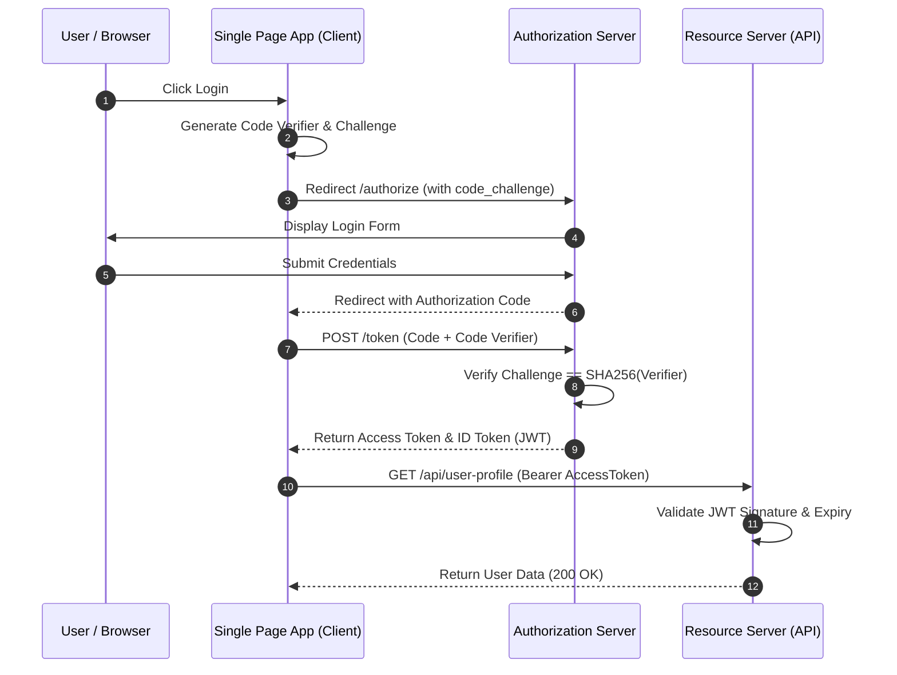

<!-- section:definition -->
## Definition and Problem Statement

OAuth 2.1 is the modern security standard that consolidates best practices by deprecating insecure grant types (Implicit flow and Resource Owner Password Credentials) while mandating Proof Key for Code Exchange (PKCE) for all clients.

OpenID Connect (OIDC) is a stateless identity authentication layer built on top of OAuth 2.1 using JSON Web Tokens (JWT) to authenticate users across web and mobile platforms.

<!-- section:components -->
## Core Components

- **Authorization Server (IdP):** Centralized identity provider validating credentials and issuing Access Tokens and ID Tokens.
- **Client (SPA / Mobile App):** Public client requesting authorization to access protected resources on behalf of the user.
- **Resource Server (API Gateway / Microservice):** Validates incoming Bearer Access Tokens before granting resource access.
- **PKCE (Proof Key for Code Exchange):** Cryptographic code verifier/challenge pair mitigating authorization code interception attacks.

<!-- section:data-flow -->
## Data & Control Flow (PKCE Mermaid Diagram)

<!-- section:use-cases -->
## Use Cases and Trade-offs

### Primary Use Cases
- **SPA and Mobile Applications:** Public clients unable to securely store client secrets in client environments.
- **Microservices SSO:** Centralized Single Sign-On (SSO) across distributed microservices using OIDC identity tokens.

<!-- section:trade-offs -->
### Architectural Trade-offs
- **Additional Network Round-trips:** PKCE authorization code exchange requires an extra token endpoint request.
- **Stateless Revocation:** Immediate JWT revocation requires centralized token revocation lists (JTI blacklisting).

<!-- section:production -->
## Production & Operational Considerations

1. **Token Storage:** Access tokens should reside in memory or `HttpOnly SameSite` cookies to prevent XSS/CSRF compromise.
2. **Key Rotation (JWKS):** IdPs must periodically rotate signing keys; Resource Servers should cache JWKS endpoints.

<!-- section:security -->
## Security Concerns

- **Mandatory PKCE:** Enforce `S256` transformation for PKCE challenges. Plain challenge methods must be rejected.
- **Token Confusion:** Strictly segregate ID Token (identity scope) from Access Token (authorization scope).

<!-- section:testing -->
## Testing and Validation

- Validate that authorization code redemption requests without a valid `code_verifier` fail with `400 Bad Request`.

<!-- section:observability -->
## Observability

- Track failed authentication attempts, token refresh latency, and signature validation errors in SIEM dashboards.

<!-- section:alternatives -->
## Alternatives

- **Session-Based Auth:** Traditional stateful authentication for single monolithic applications.
- **SAML 2.0:** Legacy enterprise federation framework.

<!-- section:sources -->
## Sources

- RFC 6749 / RFC 7636 — *OAuth 2.0 & PKCE Specifications*
- OpenID Foundation — *OpenID Connect Core 1.0*
