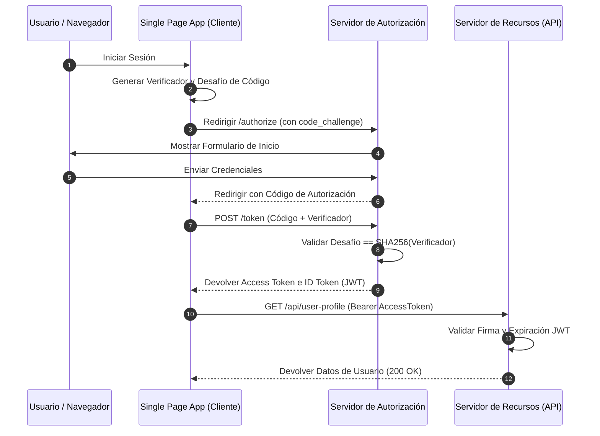

<!-- section:definition -->
## Definición y Descripción del Problema

OAuth 2.1 es el estándar de seguridad moderno que consolida las mejores prácticas al eliminar flujos inseguros (Implicit y Resource Owner Password Credentials) y hacer obligatorio el uso de PKCE (Proof Key for Code Exchange) para todos los clientes.

OpenID Connect (OIDC) es una capa de autenticación de identidad sin estado sobre OAuth 2.1 que utiliza tokens JWT para autenticar usuarios en plataformas web y móviles.

<!-- section:components -->
## Componentes Principales

- **Authorization Server (IdP):** Proveedor de identidad centralizado que valida credenciales y emite Access Tokens e ID Tokens.
- **Client (SPA / App Móvil):** Cliente público que solicita autorización para acceder a recursos protegidos en nombre del usuario.
- **Resource Server (API Gateway / Microservicio):** Valida los tokens de acceso Bearer antes de otorgar acceso.
- **PKCE (Proof Key for Code Exchange):** Mecanismo criptográfico que evita ataques de intercepción de código de autorización.

<!-- section:data-flow -->
## Flujo de Datos y Control (Diagrama Mermaid PKCE)

<!-- section:use-cases -->
## Casos de Uso y Compromisos

### Casos de Uso Principales
- **SPA y Aplicaciones Móviles:** Clientes públicos incapaces de almacenar secretos de cliente de forma segura.
- **SSO en Microservicios:** Autenticación única (Single Sign-On) centralizada entre microservicios mediante OIDC.

<!-- section:trade-offs -->
### Compromisos (Trade-offs)
- **Latencia Adicional:** El intercambio PKCE requiere una solicitud HTTP adicional al endpoint de token.
- **Revocación de JWT:** Los tokens sin estado requieren listas de revocación (JTI blacklisting) para invalidación inmediata.

<!-- section:production -->
## Desafíos de Producción y Operación

1. **Almacenamiento de Tokens:** Los tokens deben residir en memoria o galletas `HttpOnly SameSite` para evitar XSS/CSRF.
2. **Rotación de Claves (JWKS):** Los servidores de autorización deben rotar claves periódicamente; los servidores de recursos deben almacenar en caché los endpoints JWKS.

<!-- section:security -->
## Consideraciones de Seguridad

- **PKCE Obligatorio:** Forzar el método `S256` en el desafío PKCE. Se deben rechazar métodos `plain`.
- **Separación de Roles de Token:** Diferenciar estrictamente ID Token (identidad) de Access Token (autorización).

<!-- section:testing -->
## Pruebas y Validación

- Validar que las solicitudes de token sin un `code_verifier` válido devuelvan un error `400 Bad Request`.

<!-- section:observability -->
## Observabilidad

- Monitorizar intentos fallidos de autenticación, latencia de renovación de tokens y errores de firma en paneles SIEM.

<!-- section:alternatives -->
## Alternativas

- **Autenticación Basada en Sesión:** Autenticación con estado para aplicaciones monolíticas simples.
- **SAML 2.0:** Marco de federación empresarial heredado.

<!-- section:sources -->
## Fuentes

- RFC 6749 / RFC 7636 — *OAuth 2.0 & PKCE Specifications*
- OpenID Foundation — *OpenID Connect Core 1.0*
