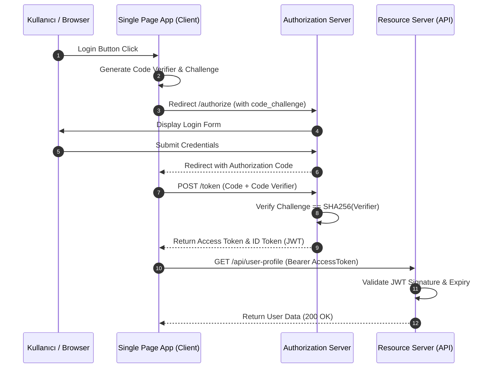

<!-- section:definition -->
## Tanım ve Çözdüğü Problem

OAuth 2.1; modern web, mobil ve tek sayfalı uygulamalarda (SPA) yetkilendirme standartlarını sadeleştiren, güvensiz olarak kabul edilen Implicit ve Resource Owner Password Credentials (ROPC) akışlarını tamamen yürürlükten kaldıran yeni nesil güvenlik standardıdır. 

OpenID Connect (OIDC) ise OAuth 2.1 yetkilendirme katmanının üzerine inşa edilmiş, JSON Web Token (JWT) tabanlı durumsuz (stateless) bir **Kimlik Doğrulama (Authentication)** protokolüdür.

<!-- section:components -->
## Temel Bileşenler

- **Authorization Server (IdP):** Kullanıcı kimliğini doğrulayan, erişim jetonu (Access Token) ve ID Token üreten merkezi sunucu.
- **Client (SPA / Mobile App):** Kullanıcı adına korumalı kaynaklara erişmek isteyen uygulama.
- **Resource Server (API Gateway / Backend):** Access Token ile gelen istekleri doğrulayan mikroservis veya API katmanı.
- **PKCE (Proof Key for Code Exchange):** `code_verifier` ve `code_challenge` çiftiyle authorization code müdahalesi (interception attacks) riskini engelleyen güvenlik mekanizması.

<!-- section:data-flow -->
## Veri ve Kontrol Akışı (PKCE Mermaid Akışı)

<!-- section:use-cases -->
## Kullanım Alanları ve Değiş-Tokuşlar

### Ideal Kullanım Alanları
- **SPA ve Mobil Uygulamalar:** İstemci tarafında gizli anahtar (client secret) saklayamayan güvenilmeyen ortamlar (Public Clients).
- **Mikroservis Kimlik Yönetimi:** Çoklu mikroservisler arasında OAuth 2.1 + OIDC ile merkezi Single Sign-On (SSO).

<!-- section:trade-offs -->
### Değiş-Tokuşlar (Trade-offs)
- **Ek İletişim Turu (Round-trips):** PKCE akışı istemci ile Auth Server arasında ek token değişim isteği gerektirir.
- **Token Boyutu ve Geçersiz Kılma:** JWT jetonları durumsuzdur; hemen iptal etmek (revocation) için JTI karaliste mekanizması gerekir.

<!-- section:production -->
## Üretim ve Operasyon Zorlukları

1. **Token Storage:** Access Token bellekte (in-memory) saklanmalı, XSS ve CSRF riskleri nedeniyle `localStorage` yerine `HttpOnly SameSite` çerezler tercih edilmelidir.
2. **Key Rotation (JWKS):** Authorization Server imzalama anahtarlarını düzenli olarak rotasyona tabi tutmalı, Resource Server JWKS uç noktasını önbelleğe almalıdır.

<!-- section:security -->
## Güvenlik Kaygıları

- **PKCE Zorunluluğu:** Tüm istemcilerde `S256` yöntemi ile PKCE kullanımı zorunlu tutulmalıdır. `plain` yöntemi kullanılmamalıdır.
- **Token İhlali:** ID Token kullanıcının kimliği için, Access Token ise API erişimi içindir; iki jeton birbirinin yerine kullanılmamalıdır.

<!-- section:testing -->
## Test ve Doğrulama

- Auth Server mock edilerek PKCE parametre doğrulamasız isteklerin reddedildiği (400 Bad Request) test edilmelidir.

<!-- section:observability -->
## Gözlemlenebilirlik

- Başarısız oturum açma denemeleri, gecikmiş token yenilemeleri (Refresh Token) ve geçersiz imza sayıları SIEM panellerinde izlenmelidir.

<!-- section:alternatives -->
## Alternatifler

- **Geleneksel Session-Based Auth:** Tekil monolit uygulamalar için yetersiz ancak basit alternatif.
- **SAML 2.0:** Eski kurumsal federasyon mimarileri için.

<!-- section:sources -->
## Kaynaklar

- RFC 6749 / RFC 7636 — *OAuth 2.0 & PKCE Specifications*
- OpenID Foundation — *OpenID Connect Core 1.0*
